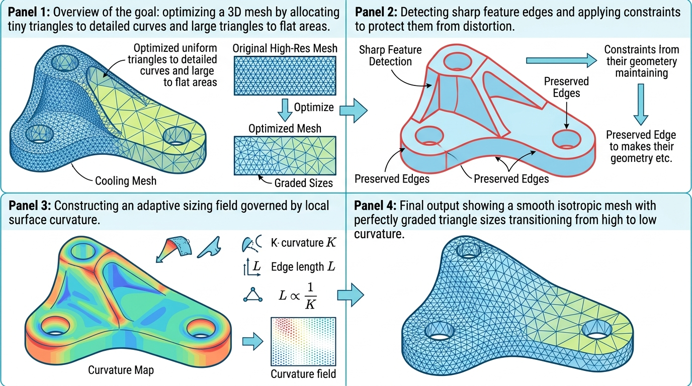

# vtkSHYXAdaptiveIsotropicRemesher (自适应各向同性重网格化)

## 示意图

## 1. 目的与功能算法详细解释

**目的与功能：**
这段代码实现了一个基于曲率感知的**自适应各向同性重网格化 (Adaptive Isotropic Remeshing)** 算法。主要用于对三维模型进行高质量的网格重构。在平坦区域，算法会使用较大的均匀三角形来覆盖以优化性能；而在曲率较高或细节较多的区域，算法会自动采用更细小密集的三角形以精准还原几何特征。同时，该算法能够保护模型原有的尖锐特征边，避免在平滑过程中丢失。

**算法流程：**
本算法底层依赖 CGAL (6.0+) 几何算法库：
1. **特征检测 (Feature Detection)：** 首先扫描整个网格，根据设定的角度阈值（`ProtectAngle`），找出所有特征边，并在后续操作中施加保护约束，防止它们在网格重构时被过度平滑。
2. **构建自适应尺寸场 (Adaptive Sizing Field)：** 结合给定的曲率误差容限（`AdaptiveTolerance`）以及设定的最大/最小边长限制，为模型表面生成自适应尺寸场。在曲率较大的区域，分配较小的三角形尺寸。
3. **各向同性重网格化 (Isotropic Remeshing)：** 根据上一步的自适应尺寸场，对网格进行多次各向同性重网格化迭代操作（包含顶点插入、边折叠、边翻转以及网格平滑松弛），最终输出高质量且过渡自然的网格模型。

---

## 2. 参数列表及其效果和含义

以下为算法的核心控制参数：

| 参数名称 | 类型 | 默认值 | 效果和含义 |
| :--- | :--- | :--- | :--- |
| **`MinEdgeLength`** | `double` | `0`（自动） | **最小边长限制**。`<= 0` 时自动为轴对齐包围盒**最长边**的 **0.5%**（与 ParaView `BoundsDomain` scaled_extent 一致）。XML 上挂了该 Domain，属性旁有官方缩放/重置。 |
| **`MaxEdgeLength`** | `double` | `0`（自动） | **最大边长限制**。`<= 0` 时自动为同一**最长边**的 **5%**。界面为宽范围数值框，便于设更大的粗网格上限。 |
| **`AdaptiveTolerance`** | `double` | `0.001` | **自适应容差**。控制网格精细度的核心参数，定义了离散曲率的误差容限。该值必须严格大于 0。**值越小，系统对曲率变化越敏感**，会在规定的边长范围内生成更密集的网格来拟合曲率。 |
| **`ProtectAngle`** | `double` | `45.0` | **特征边保护角度阈值（度）**。当两个相邻面的法线夹角大于此阈值时，交接边将被判定为特征边。这些边在重网格化过程中会受到保护，确保模型几何特征不丢失。 |
| **`NumberOfIterations`** | `int` | `3` | **迭代次数**。CGAL 执行各向同性重网格化的循环次数。次数越多，网格质量通常越高，三角形越接近等边三角形，但计算耗时也会增加。该值必须 `>= 1`。 |
