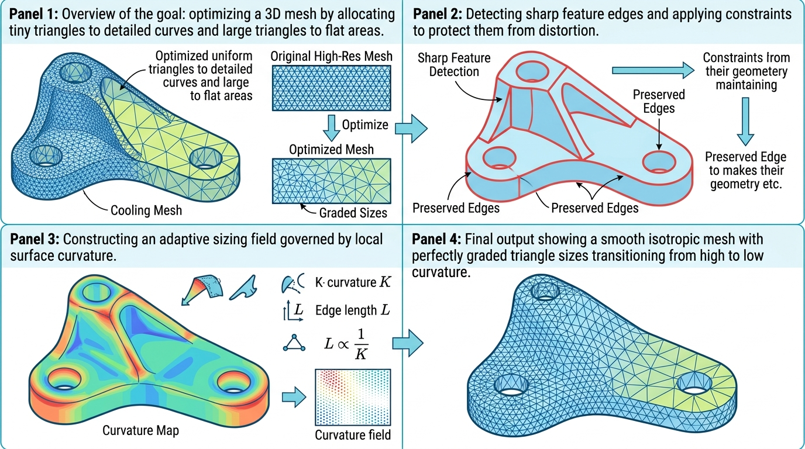

# vtkSHYXAdaptiveIsotropicRemesher (自适应各向同性重网格化)

## 示意图

## 1. 目的与功能算法详细解释

**目的与功能：**
这段代码实现了一个基于曲率感知的**自适应各向同性重网格化 (Adaptive Isotropic Remeshing)** 算法。主要用于对三维模型进行高质量的网格重构。在平坦区域，算法会使用较大的均匀三角形来覆盖以优化性能；而在曲率较高或细节较多的区域，算法会自动采用更细小密集的三角形以精准还原几何特征。同时，该算法能够保护模型原有的尖锐特征边，避免在平滑过程中丢失。

**算法流程：**
本算法底层依赖 CGAL (6.0+) 几何算法库：
1. **特征检测 (Feature Detection)：** 首先扫描整个网格，根据设定的角度阈值（`ProtectAngle`），找出所有特征边，并在后续操作中施加保护约束，防止它们在网格重构时被过度平滑。
2. **构建自适应尺寸场：** 使用仓库自定义 **`FeatureAwareAdaptiveSizingField`**（ICC），**不是** CGAL 自带 `Adaptive_sizing_field`。结合 `AdaptiveTolerance` 与 Min/Max 边长，在曲率较大的区域分配较小三角形尺寸。
3. **各向同性重网格化 (Isotropic Remeshing)：** 根据上一步的自适应尺寸场，对网格进行多次各向同性重网格化迭代操作（包含顶点插入、边折叠、边翻转以及网格平滑松弛），最终输出高质量且过渡自然的网格模型。

---

## 2. 参数列表及其效果和含义

以下为算法的核心控制参数：

| 参数名称 | 类型 | 默认值 | 效果和含义 |
| :--- | :--- | :--- | :--- |
| **`MinEdgeLength`** | `double` | `0`（未设） | **最小边长**。C++ **不会**把 0 自动换成包围盒比例；`RequestData` 要求 `0 < Min < Max`。ParaView 上 BoundsDomain 建议约 AABB 最长边的 **0.1%**，需点 Scale/Reset 才写入。非 ParaView 调用必须显式设正值。 |
| **`MaxEdgeLength`** | `double` | `0`（未设） | **最大边长**。Domain 建议约最长边的 **10%**（`scale_factor=0.1`）。 |
| **`AdaptiveTolerance`** | `double` | `0.01` | **ICC sizing 容差**。必须 > 0。**值越小**对曲率越敏感，在 Min/Max 范围内更密。 |
| **`ProtectAngle`** | `double` | `70.0` | **特征边保护角度（度）**。相邻面法线夹角大于此阈值时保护该边。 |
| **`NumberOfIterations`** | `int` | `3` | CGAL 各向同性重网格循环次数。必须 `>= 1`。面板标签 **Remesh iterations**。 |
| **`NumberOfRelaxationSteps`** | `int` | `3` | 每轮切向松弛步数（CGAL 文档默认常为 1；本滤镜默认 3）。面板标签 **Relaxation steps**。 |

**输出端口**：0 remeshed `vtkPolyData`；1 特征线；2 mask patch；3 sizing/ICC preview。可选 Selection（port 1）或标量范围只重网格一部分；空选区 = 整张表面。

面板其余项（Expansion ratio、Scale to range、Detect feature edges、Feature mask、Remesh constraints 等）见同目录 `SHYXAdaptiveIsotropicRemesher.xml`；同模块还有 Vascular 用的 `SHYXRemeshWithEndpoint.xml`。

---

## 3. 多轮 remesh + `collect_garbage`（踩坑记录）

适用：`vtkSHYXRemeshWithEndpoint` / `vtkSHYXAdaptiveIsotropicRemesher` 在 **`NumberOfIterations > 1`** 时，把 CGAL `isotropic_remeshing` 拆成多次 `number_of_iterations(1)`，并在轮次间可选 `recompute_curvature`。

### 现象

- **iters=1**：正常（约数秒量级，视网格而定）。
- **iters=2 且关闭** `RemeshRecomputeCurvatureEachIteration`：两轮都快。
- **iters=2 且打开** recompute：第 1 轮正常结束后，第 2 轮 `isotropic_remeshing` **长时间无返回**（像死锁；profile 心跳可持续数分钟）。
- **两个 filter 串联、各 iters=1**（第二遍输入是第一遍的 VTK 输出）：两遍都快。容易误以为「等价于单 filter iters=2 + recompute」，实际不等价。

### 排查结论（非 Expansion ratio / 非 sizing 过狠）

Profiling（当时写入 `%TEMP%/vespa_shyx_sizing_profile.log`，现已移除）表明：

1. Expansion / Dijkstra、ICC、recompute 本身都在百毫秒级，不是瓶颈。
2. 卡住点是 **第 2 次** `PMP::isotropic_remeshing` 内部。
3. remesh 前网格 `is_valid_polygon_mesh`、无退化面、非流形启发式均为正常；recompute 后的 `tooLong`/`tooShort` 比例与「快的第二 filter」几乎相同。
4. 第 1 轮 remesh 后 `Surface_mesh` 留下大量 **garbage**（实测约 removed v/e/f ≈ 9.6e4 / 2.9e5 / 1.9e5）。不压缩清理就再 remesh，CGAL 极易极慢/空转。
5. 在 remesh / recompute 前调用 **`mesh.collect_garbage()`** 后，第 2 轮恢复正常（约数秒，顶点数变化与串联第二 filter 同量级，几何非 bit-exact）。

网上相近报告多指向非法/非流形网格或 `protect_constraints` 过长约束边死循环；本案 **valid=1、protect=0**，更贴近「带 garbage 的 mesh 上连续第二次 remesh」这一类实现细节，而非文档里的经典坑。

### 与「两个 filter」的差异

| | 单 filter iters=2 + recompute | 两个 filter 各 iters=1 |
|--|--|--|
| 网格 | 同一块 CGAL `Surface_mesh` 连续 remesh | toVTK → 再 toCGAL（隐式干净网格） |
| 法向/ICC | 轮次间 `recompute_curvature`（plain `compute_vertex_normals`） | 每滤镜完整 `PrepareIccVertexNormals` |
| sizing 对象 | 同一 `FeatureAwareAdaptiveSizingField` 刷新 map | 每滤镜新建 |
| 无 `collect_garbage` 时 | 第 2 轮可挂死 | 不受影响（重建无 garbage） |

### 代码约定

- `vtkSHYXRemeshWithEndpoint`：wall 与 **cap** 多轮 remesh 前/后、recompute 前，若 `has_garbage()` 则 `collect_garbage()`。
- `vtkSHYXAdaptiveIsotropicRemesher`：同样在多轮 remesh 路径上清理 garbage（同一类 bug）。

### 相关 CGAL 参考（背景，非本案根因）

- [CGAL#3565](https://github.com/CGAL/cgal/issues/3565) remesh 极慢 → 非法网格  
- [CGAL#4133](https://github.com/CGAL/cgal/issues/4133) remesh never return → 非流形修复副作用  
- 官方文档：`protect_constraints` + 过长约束边 → cascade split；需先 `split_long_edges`  

