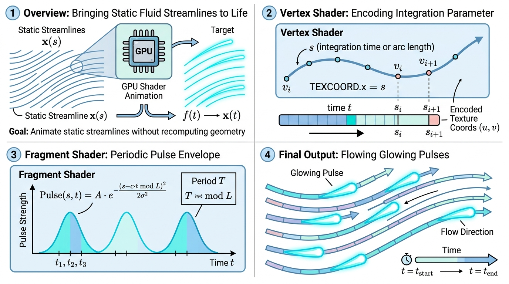

# Animated Streamline Representation (动态流线可视化)

## 示意图



## 1. 目的与功能算法详细解释

### 🎯 核心目的
在科学可视化中，展示流体（如风场、水流）的运动轨迹通常需要重构流线的几何顶点来生成动画，这会带来较高的 CPU 与内存开销。本模块的目的在于**通过纯 GPU 着色器 (Shader) 技术，在静态几何体上实现高效且逼真的流体动画效果**，从而显著提升渲染性能。

### 🧠 算法原理解析
其核心机制依赖于 `vtkAnimatedStreamlineCompositePolyDataMapper` 和自定义的 GLSL 着色器替换 (Shader Replacements)：
1. **数据准备 (CPU 端)**：自动获取数据中的积分时间（`IntegrationTime`）等标量数组，并将其映射到顶点的纹理坐标（`tcoord.x` 和 `tcoord.y`）中。若未找到指定标量，则使用顶点沿流线的弧长 (Arc Length) 作为替代。
2. **顶点着色器 (Vertex Shader)**：提取纹理坐标，并传递给片段着色器。
3. **片段着色器 (Fragment Shader)**：利用公式计算出一个周期性的脉冲值 (Pulse)：
   ```glsl
   float mixValue = animCoordx * integrationScale + time * timeScale / animCoordy;
   float phase = fract(mixValue); // 取小数部分，实现循环动画
   float pulse = 1.0 - pow(clamp(truncValue * phase, 0.0, 1.0), powValue);
   ```
   随后，将计算得到的 `pulse` 与颜色的 Alpha（透明度）通道相乘。此操作能够使流线的局部区域变亮并呈现带拖尾的衰减效果，在时间变量 `time` 的驱动下形成流动的动画视觉体验。

---

## 2. 参数列表及其效果和含义

以下是控制流线动画表现的主要参数：

* **`Animate` (bool)**
  * **含义**：动画总开关。
  * **效果**：设为 `true` 时启用动画渲染，设为 `false` 则保持静态展示。
* **`OpacityScale` (double)** 
  * **含义**：整体不透明度缩放（默认 `0.8`）。
  * **效果**：控制动画高亮部分的透明度。可适当调低以避免视觉过于强烈。
* **`TimeScale` (double)** 
  * **含义**：时间缩放系数（默认 `0.4`）。
  * **效果**：调节流动**速度**。值越大，动画演进速度越快。
* **`IntegrationScale` (double)** 
  * **含义**：空间积分缩放系数（默认 `50.0`）。
  * **效果**：调节脉冲在空间上的**密集程度**（频率）。值越大，同一条流线上同时出现的脉冲高亮区域越多。
* **`Trunc` (double)** 
  * **含义**：截断阈值（默认 `2.0`）。
  * **效果**：控制脉冲的**有效长度**。它是对相位进行的乘积截断，值越大，发光部分占整体周期的比例越小，脉冲视觉上更短、更锐利。
* **`Pow` (double)** 
  * **含义**：衰减指数（默认 `1.0`）。
  * **效果**：控制动画拖尾的**消散曲线**。值大于 1 会使透明度非线性快速衰减，值小于 1 则产生更平滑的拖尾过渡。
* **`AnimationCoordinateArray` (string)** 
  * **含义**：主动画坐标绑定的数据列名（默认 `"IntegrationTime"`）。
  * **效果**：指定用于驱动 Shader 动画演化的物理量数组，通常为流线的积分时间。
* **`AnimationCoordinateYArray` (string)** 
  * **含义**：可选的副动画坐标数组名。
  * **效果**：在 Shader 中作为时间项的除数 (`time * timeScale / animCoordy`)。该参数支持基于局部标量场（如局部流速）实现非均匀的动画演进效果。