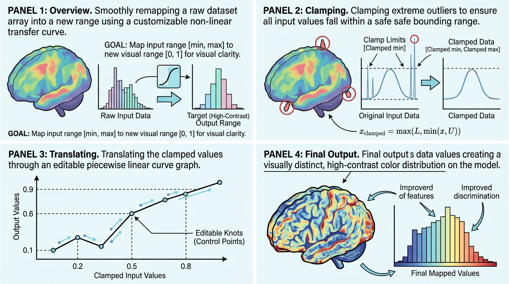

# vtkArrayCurveMapper

## 示意图

## 1. 目的与功能算法详细解释

**目的**：
`vtkArrayCurveMapper` 是一个用于数据映射的处理组件。它接收指定的点数据数组（标量或多维向量），通过配置的分段线性传递函数（`vtkPiecewiseFunction`），将原始数据平滑映射至新的数值区间，并最终输出为一个全新的标量点数据 (Point Data) 数组。

**算法流程**：
1. **输入验证与浅拷贝**：首先检查输入数据 (`vtkDataSet`) 是否有效且包含顶点。确认后，利用浅拷贝 (`ShallowCopy`) 复制输入数据到输出中，以保留原有网格拓扑与非相关属性。
2. **提取目标数组**：根据指定的 `InputArrayName` 提取目标数组。若数组不存在或未配置传递函数，算法将直接返回 1 保持数据原样，以保证管线的稳定性。
3. **数据预处理与范围限制**：遍历所有顶点数据：
   - 对于多维向量（如坐标或速度），计算其模长 (Magnitude) 作为标量值。
   - 对于标量数据，直接读取。
   - 将提取的数值严格限制 (Clamp) 在 `[InputRangeMin, InputRangeMax]` 区间内。
4. **曲线映射 (Curve Evaluation)**：使用限制后的数值在 `vtkPiecewiseFunction` 中查询。曲线 **Y 轴为物理输出值**（落在 OutputRange 内），不再使用归一化 `t`。
5. **输出钳制**：将曲线求值结果再钳制到 `[OutputRangeMin, OutputRangeMax]`，并存入新数组。
6. **输出装载**：将生成的新数组以 `OutputArrayName` 为名，挂载至与输入相同的属性类型（Point/Cell Data）。

---

## 2. 参数列表及其效果和含义

以下为该模块的核心配置参数及扩展参数：

### 核心映射参数
* **`InputArrayName`** (string): 输入数组名称。指定需进行映射处理的数据列。
* **`OutputArrayName`** (string): 输出数组名称。默认值为 `"MappedArray"`，表示映射后生成的新数组名称。
* **`InputRangeMin` / `InputRangeMax`** (double): 输入数据范围限制（默认 `[0.0, 1.0]`）。超出此区间的原始值将被截断并限制在该边界上。
* **`OutputRangeMin` / `OutputRangeMax`** (double): 输出数据的目标范围（默认 `[0.0, 1.0]`）。曲线控制点的 Y 值与此范围一致。
* **`CurveTransferFunction`** (`vtkPiecewiseFunction*`): 分段线性传递函数；X = 输入值，Y = 映射后的输出值。面板提供可编辑曲线与输入/输出直方图预览。

### 渲染与视觉表现参数 (预留扩展)
* **`RepresentationMode`** (int): 表现模式，包括表面 (`REPRESENTATION_SURFACE`=0)、体积 (`REPRESENTATION_VOLUME`=1) 和点高斯 (`REPRESENTATION_POINT_GAUSSIAN`=2)。
* **`Opacity`** (double): 整体不透明度（默认 `0.8`）。
* **`Trunc`** (double): 截断参数（默认 `1.2`）。
* **`Pow`** (double): 幂次参数（默认 `1.5`）。预留于未来的非线性计算。

### 动画与高级特征参数 (预留扩展)
* **`IntegrationScale` / `TimeScale` / `Time`**: 时间与空间缩放相关参数，预留用于流线或动态视觉效果。
* **`AnimationArrayName`** (string): 动画关联数组名（默认 `"IntegrationTime"`）。
* **`AnimatedOpacityArrayName`** (string): 动画透明度数组名（默认 `"AnimatedOpacity"`）。
* **`PointGaussianRadiusArrayName`** (string): 点高斯半径数组名（默认 `"AnimatedPointRadius"`）。
* **`VolumeDensityArrayName`** (string): 体积密度数组名（默认 `"AnimatedVolumeDensity"`）。