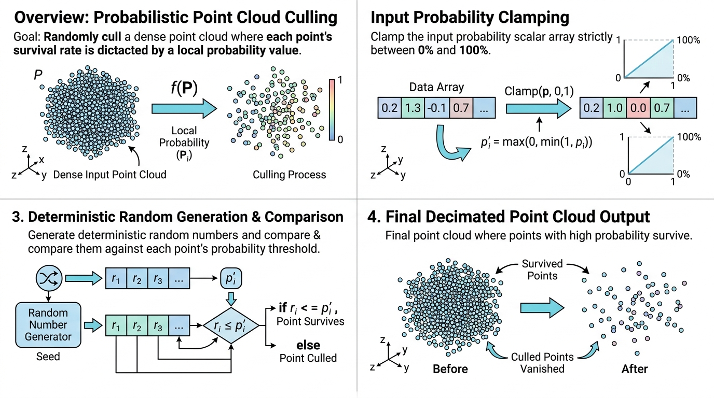

# Array Probability Point Cull (基于数组概率的点云剔除)

## 示意图

## 1. 目的与功能算法详细解释

**目的**：
`vtkSHYXArrayProbabilityPointCull` 的主要目的是基于输入数据集的点标量数据 (Point Data Scalars)，对点云执行概率性降采样 (Subsampling)。算法根据数据点指定的概率值决定其是否被保留于最终结果中。

**功能与算法流程**：
1. **读取概率**：从指定的点数据数组（权重数组）中读取每个点的标量值 $v$（仅使用首个分量）。
2. **截断处理 (Clamping)**：将标量值严格限制在 $[0, 1]$ 区间内，计算保留概率 $p = \max(0, \min(1, v))$。**该过程不涉及全局归一化**。例如标量值为 0.3 代表 30% 保留概率，大于 1 的值将作为 100% 保留处理，负值则作 0% 处理。
3. **随机抽样**：
   - 为每个点生成一个 $[0, 1]$ 的随机数。若随机数 $< p$，该点被保留。
   - **多线程支持 (SMP)**：在启用多线程 (`VESPA_USE_SMP`) 时，为保证降采样的**可重复性**，算法基于 `(Seed, pointId)` 使用 `SplitMix64` 确定性随机流。无论线程调度如何，只要种子和点 ID 保持一致，采样结果便能完全复现。
   - **单线程模式**：若未启用 SMP，则使用 VTK 内置的 `vtkMinimalStandardRandomSequence` 进行线性随机抽样。
4. **输出生成**：被保留的点将构建为一个由顶点单元 (Vertex Cells) 组成的 `vtkPolyData` 对象，并继承源数据集的所有数据属性。

若指定的数组名称为空或设定为 `"(Uniform)"`，算法将跳过概率判定，无条件保留所有点。

---

## 2. 参数列表及其效果和含义

| 参数名 | 类型 | 默认值 | 效果与含义 |
| :--- | :--- | :--- | :--- |
| **WeightArrayName** | `std::string` | `""` | **权重数组名称**。 指定用于读取保留概率的点数据标量数组名。如果留空或设置为 `"(Uniform)"`，算法将默认所有点保留概率为 100%。未找到指定数组时，将输出警告并自动退化为全保留模式。 |
| **Seed** | `int` | `0` | **随机种子**。 控制随机数生成器的初始种子，以确保结果的可复现性。在多线程模式下，该种子将结合每个点的全局 ID 生成唯一哈希值，进而保证并行处理过程中的确定性行为。 |