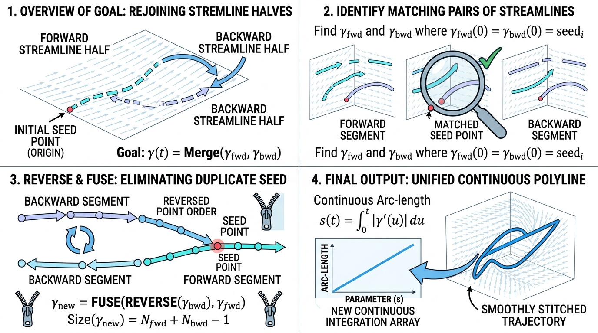

# BidirectionalStreamlineMerge (双向流线合并)

## 示意图

## 1. 目的与功能算法详细解释

**目的**：
在流线追踪 (Stream Tracing) 过程中，单个种子点 (Seed) 通常会生成前向和后向两条多段线 (Polyline)。`BidirectionalStreamlineMerge` 模块的主要目的是将来源于同一初始种子的双向流线段合并为一条连续的单向流线，同时清理连接处的重复顶点，确保流线的连续性。

**功能与核心算法**：
1. **种子匹配 (Match-making)**：滤镜根据指定的 `SeedIds` 数组，对所有的线段单元 (`LINE` 或 `POLY_LINE`) 进行分组匹配，将属于同一初始种子的流线归为一类。
2. **反向拼接 (Reverse & Stitch)**：针对包含两条分支的种子组，算法默认输入顺序中的第二条为后向分支。将其顶点顺序进行反转后，与前向分支进行首尾相接的无缝拼合。
3. **节点去重 (Junction Clean-up)**：由于两条分支源于同一出发点，合并处会产生重复顶点。算法通过判断顶点 ID 或空间坐标是否严格相等，剔除冗余的连接点。对于仅包含单向线段的种子点，则直接原样保留。
4. **数据计算 (Integration & Differentiation)**：合并流线之余，本模块支持沿顶点顺序计算累积梯形积分（基于顶点索引累加，而非实际几何长度）以及一阶后向差分。

## 2. 参数列表及其效果和含义

以下为本模块提供的控制参数说明：

* **`SeedIdsArrayName` (string)**: 
  * *含义*：用于标识同源种子的数组名称。默认值为 `"SeedIds"`。
* **`SeedIdsOnCells` (int/bool)**:
  * *含义*：标识种子 ID 存储于单元数据 (Cell Data) 还是点数据 (Point Data) 中。默认开启 (`1`)。
  * *效果*：开启时读取单元数据；关闭时，读取每条多段线首个顶点的点数据作为种子 ID。
* **`GeneratePointIdArray` (int/bool)**:
  * *含义*：是否生成新的顶点 ID 数组。默认开启 (`1`)。
  * *效果*：若开启，将在输出中调用 `vtkGenerateIds` 为合并后的流线点生成从 `0` 到 `N-1` 的连续索引。
* **`PointIdsArrayName` (string)**:
  * *含义*：新生成的顶点 ID 数组的名称。默认值为 `"PointIds"`。
* **`ComputeArcLengthIntegral` (int/bool)**:
  * *含义*：是否沿流线计算累积积分。默认关闭 (`0`)。
  * *效果*：启用后，采用梯形法则按顶点索引进行累加求和。对于矢量数据，则计算其模长的积分。
* **`IntegrandArrayName` (string)**:
  * *含义*：用于积分计算的输入点数据数组名。
* **`IntegralArrayName` (string)**:
  * *含义*：积分结果的输出数组名。默认值为 `"StreamlineIntegral"`。
* **`ComputeIntegrandDelta` (int/bool)**:
  * *含义*：是否计算沿线的后向差分（即当前点与前一点之差）。默认关闭 (`0`)。
  * *效果*：计算公式为 $f_i - f_{i-1}$。该数组的首个元素将赋值为 `NaN`。
* **`DeltaArrayName` (string)**:
  * *含义*：差分结果的输出数组名。默认值为 `"StreamlineIntegrandDelta"`。
* **`EnablePerStreamlineRandomOffset` (int/bool)**:
  * *含义*：是否为每条流线整体增加随机偏移量。默认关闭 (`0`)。
  * *效果*：为同一条流线上的所有顶点应用相同的随机偏移量。
* **`RandomOffsetArrayName` (string)**:
  * *含义*：应用随机偏移的输入点数据数组名称（该数据会被附加偏移量后输出）。
* **`RandomOffsetRangeMax` (double)**:
  * *含义*：随机偏移上限参数，随机数均匀分布于 $[0, n]$ 之间。默认值为 `1.0`。
* **`RandomOffsetSeed` (int)**:
  * *含义*：随机数生成器种子。默认值为 `0`。控制随机偏移的可复现性。