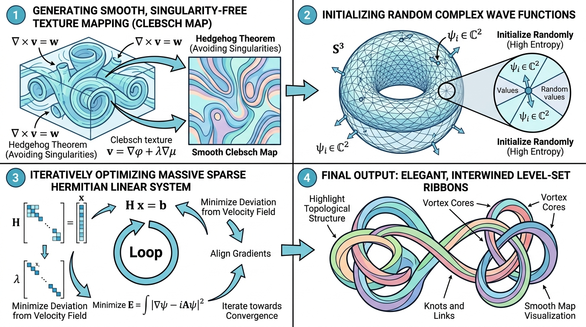

# vtkSHYXClebschMapFilter

## 示意图

## 1. 目的与功能算法详细解释

### 目的与功能
`vtkSHYXClebschMapFilter` 是一款基于 SIGGRAPH 2017 论文《Inside Fluids: Clebsch Maps for Visualization》实现的流体可视化滤镜。它的主要目的是将流体场中的速度场（$\eta_0$）映射到四维空间三维球面（$S^3$）上的波函数（$\psi$）。通过这种映射算法，能够生成无奇点的流体表面与纹理，以直观且准确的方式可视化流场中的涡管（Vortex Tubes）与复杂拓扑结构。该滤镜支持包含矢量数据的四面体网格输入，并输出包含四个分量的波函数数组 `Clebsch_Psi_S3`。

### 算法流程
1. **初始化 (Initialization)**：根据设定的随机种子，为网格内的各个顶点随机生成复数波函数 $\psi \in \mathbb{C}^2$（分布于 $S^3$ 球面），并执行归一化处理。
2. **离散外微分预计算 (DEC Precomputation)**：遍历输入的四面体网格，计算各顶点的质量矩阵（Mass Matrix，$M_V$）、边权重（$w_{ij}$）及速度场沿边缘的积分（$\eta_0$）。在此过程中，利用几何雅可比矩阵（Jacobians）构建离散拉普拉斯算子。
3. **参数自适应 (Auto-tuning $\hbar$)**：若开启 `AutoHbar`，算法将依据网格平均边长及最大流场速度自动估算普朗克常数 $\hbar$ 的优化值，保证干涉频率处于合理区间。
4. **迭代求解器 (Iterative Solvers)**：
   - 算法采用双层嵌套循环结构。外层循环由 `epsilon` 参数控制（随迭代衰减为 $1/10$），用于引导系统逐步逼近最优解。
   - 内层循环根据当前波函数状态，构建复数稀疏埃尔米特 (Hermitian) 线性系统 $Ax = b$。
   - 若启用 `UseMKL`，则优先调用 Intel MKL 库的 Pardiso 求解器 (LLT, LDLT, LU) 加速大规模矩阵运算；否则，使用共轭梯度法 (Conjugate Gradient, CG) 迭代求解。
   - 每次求解后，波函数将同步更新并重新投影归一化至 $S^3$ 空间。
5. **输出结果**：将优化完毕的 $\psi$ 转换为 `Clebsch_Psi_S3` 数组，作为点属性附加至输出数据集，以便下游渲染管线进行等值面提取或着色处理。

---

## 2. 参数列表及其效果和含义

| 参数名称 | 类型 | 默认值 | 效果与含义 |
| :--- | :---: | :---: | :--- |
| **Hbar** ($\hbar$) | `double` | 0.1 | 尺度缩放参数，控制 Clebsch 映射的空间频率。较小的 $\hbar$ 会产生更密集的干涉条纹（高频），反之则生成较为稀疏的结构。 |
| **AutoHbar** | `bool` | true | 自动估算 $\hbar$ 选项。开启后，滤镜会结合网格特性覆盖用户设定的 `Hbar` 值，建议在缺乏先验参数时保持默认开启。 |
| **DeltaT** ($\Delta t$) | `double` | 1.0 | 迭代优化时所采用的时间步长。影响非线性优化方程的收敛速率与计算稳定性。 |
| **MaxIterations** | `int` | 20 | 内部循环的最大迭代阈值（线性系统的最大求解次数）。数值越大，单次外循环内的逼近效果越好，但相应的计算耗时将显著增加。 |
| **OuterLoops** | `int` | 5 | 外部松弛循环的执行次数。决定整体优化的深度，`epsilon` 随此循环衰减，能有效防止算法陷入局部最优状态。 |
| **RandomSeed** | `int` | 42 | 初始化波函数时的随机数种子。固定种子可保障算法的输出波函数具有确定性与可重复性。 |
| **VelocityArrayName** | `string` | "Velocity" | 指定输入数据集中表示流场速度的点向量数组名称。 |
| **UseMKL** | `bool` | false | 求解器优化开关。设定为 `true` 且环境已链接 Intel MKL 库时，将启用 Pardiso 稀疏矩阵直接求解器，大幅提升计算效率。 |