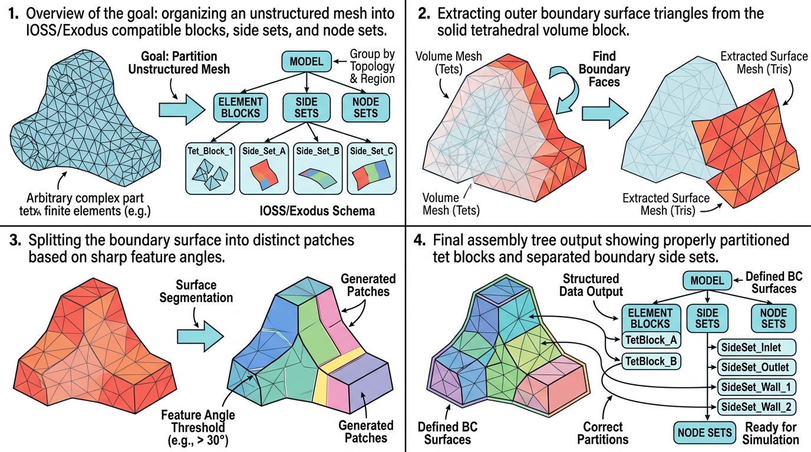

# vtkSHYXDataSetToPartitionedCollection

## 示意图

## 1. 目的与功能算法详细解释

### 🎯 核心目的
`vtkSHYXDataSetToPartitionedCollection` 模块的主要任务是将 `vtkDataSet`（通常为包含四面体单元的非结构化网格）转换并重组为兼容 `vtkIOSSWriter` (Exodus 格式) 要求的 `vtkPartitionedDataSetCollection` 数据结构。对提取出的边界 **`vtkPointData`** 标量（`PartitionPointArrayName`，默认 `EndpointIndex`）：**先**用 **`vtkThreshold`**（**`THRESHOLD_BETWEEN`**，区间端点**包含**；首分量落在 **(-∞, 0]**）配合 **All Scalars 关闭**（**任意角点**满足区间即可保留该单元），连通域结果 **`vtkAppendPolyData` 合并为 1 片**；**再**用 **`vtkThreshold`** 取首分量 **[1, +∞)**（同样任意角点），在该子网格上用 **`vtkPolyDataConnectivityFilter` 按连通性拆成 n 片**。若某单元**所有角点**的首分量都严格落在 **(0, 1)** 内，则**可能**不属于任一侧。最终得到 **至多 n+1 个** face 区域，依次生成 **`node{i}` / `side{i}`**（若「≤0」合并区域为空则为 n 对）。分界常量见源码 **`kPartitionLeZeroInclusive`** / **`kPartitionGeOneInclusive`**（0 与 1）。若点数组缺失或与点数不一致、或两步阈后均无单元，则回退为整张表面的 **特征角 + 连通域**；分区数组名为空时始终走特征角路径。若标量只在单元上，需先用 **Cell Data To Point Data** 等转到点。

### 🧠 算法流水线 (The Pipeline)
该转换过程分为以下具体步骤：

1. **提取四面体 (Tet Volume Extraction)**：从输入数据集中提取所有四面体 (`VTK_TETRA`) 单元，生成独立的 `vtkUnstructuredGrid` 对象，并为其分配连续的全局点 ID 和单元 ID（1至N），以符合 Exodus 格式对 ID 连续性的要求。
2. **表面剥离 (Surface Extraction)**：通过 `vtkDataSetSurfaceFilter` 提取四面体网格的外部边界曲面，并保留其在体网格中的 Cell IDs 与 Point IDs 映射。
3. **归属映射 (Element Side Mapping)**：识别表面每个三角形单元所属的内部四面体及其对应的面索引（Exodus 格式面编号为 1至4），并将此映射关系存储至单元数据 `element_side`，用于定义后续的侧面集 (Side Set)。
4. **符号分区 (Sign split)**：在表面点标量上执行两步 **`vtkThreshold`**（**`THRESHOLD_BETWEEN`**，端点包含；均为 **`SetAllScalars(0)`**，即任意角点满足区间即可）+ **`vtkGeometryFilter`**：**(a)** 首分量 **≤0**（实现为到 0 的闭区间阈）→ 连通域后 **`vtkAppendPolyData` 合并为 1 个 patch（若有单元）；**(b)** 首分量 **≥1**（实现为从 1 起的闭区间阈）→ **`vtkPolyDataConnectivityFilter`** 拆成 **n** 个 patch。将 (a)（若存在）置于列表首位，再依次追加 (b) 的 n 个 patch，得到 **至多 n+1** 个区域后，再经 **Sort By Area** / **Custom Post Reorder**（若开启）重排整块列表。若数组无效或阈后为空则退化为 **`vtkPolyDataNormals` + `vtkPolyDataConnectivityFilter`** 对整张表面拆分。
5. **点集清洗 (Stripping Unreferenced Points)**：对各 patch 去除未引用点。
6. **节点与侧面生成 (Node & Side Sets Generation)**：每个 patch 生成 `side{i}` 与对应 `node{i}`（`vtkVertex`），并恢复/写入 **GlobalIds** 等。
7. **数据装配 (Assembly Building)**：生成 `vtkDataAssembly`（`element_blocks` / `node_sets` / `side_sets`）。

## 2. 参数列表及其效果和含义

| 参数名称 | 类型 | 默认值 | 效果和含义 |
| :--- | :---: | :---: | :--- |
| **PartitionPointArrayName** | `char*` | `EndpointIndex` | **分区点数组名**。表面 `vtkPointData` 上用于「首分量 ≤0 合并 + ≥1 连通拆分」的首分量标量；需在点上。 |
| **FeatureAngle** | `double` | `70.0` | **特征角阈值**（回退路径）。 |
| **SortByArea** | `int` (布尔) | `1` (True) | **按面积排序**（对当前 **全部** patch 列表：≤0 的合并片 + ≥1 的各连通片）。 |
| **CustomPostReorder** | `int` (布尔) | `1` (True) | **自定义重排**（在面积排序之后，对当前 patch 列表生效）。 |
| **ComputeBoundaryRadialValue** | `int` (布尔) | `0` (False) | `BoundaryRadialValueNormal` 是否乘以 `BoundaryRadialValue`。启用时为 `BoundaryRadialValue * sideNormal`；关闭时为 `sideNormal`。 |
| **BoundaryRadialNormalFalloffFactor** | `double` | `1.0` | 指数参数 `a`：`BoundaryRadialValue = 1 - x^a`，其中 `x` 为原始径向坐标。 |
| **BoundaryVariables** | `char*` | 空 | 由 `Partitioned block names` 面板的 Side set `Variable1/2/...` 列维护；默认 `Variable1=0`，不写体点。非 0 时写入四面体体块点数据 `BoundaryRadialValueNormal`，并把变量列写入独立标量数组 `BoundaryVariable1`、`BoundaryVariable2`……。重复写入同一体点时 warning 并取平均值。 |
