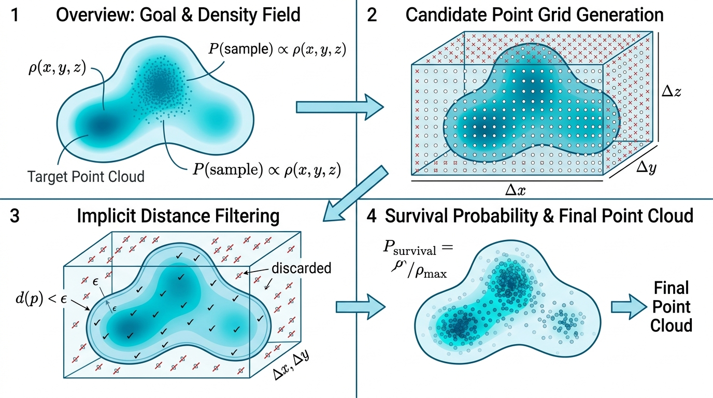

# DensityBasedSampler (基于密度的点云采样器)

## 示意图

## 1. 目的与功能算法详细解释

### 目的与功能
本模块的核心组件为 `vtkCGALDensityBasedSampler`，主要用于**在封闭的网格内部生成随机点云，且生成的点云分布密度由指定的空间标量场控制**。
该模块既支持处理体网格（如 `.vtu` 格式的 `vtkUnstructuredGrid`），也支持封闭的表面网格（`vtkPolyData`），最终输出为纯顶点几何数据（点云）。

### 算法流程
该模块的执行逻辑包含以下步骤：
1. **边界提取**：检测输入数据类型，若为体网格，则优先使用 `vtkDataSetSurfaceFilter` 提取其外部表面网格，以界定空间边界。
2. **构建笛卡尔晶格**：依据输入网格的包围盒 (Bounding Box) 尺寸与 `PreSampleCount` 参数，构建高密度的三维均匀笛卡尔网格系，生成初始候选点集。
3. **内部点筛选 (预采样)**：调用 `vtkImplicitPolyDataDistance` 计算所有候选点至表面网格的有向距离。仅保留距离 $\le 0$ 的点作为模型内部的候选点，其余位于模型外部的点将被剔除。
4. **密度随机采样 (核心采样)**：
   - 算法读取配置的 `DensityArrayName`，并通过 `vtkCellLocator` 空间插值评估每个内部候选点所在的标量值。
   - 将标量值的整体数据区间线性映射为 $0\% \sim 100\%$ 的留存概率 (Survival Probability)。
   - 利用伪随机数发生器进行判断（接受-拒绝采样法）：若生成的 $[0, 1]$ 随机数低于该点的留存概率，则点被保留入输出结果中。
   - *(注：若未指定密度数组名，算法将退化为均匀采样模式，跳过概率筛选，保留所有内部点。)*
5. **多线程并发处理**：在编译环境开启 `VESPA_USE_SMP` 的前提下，内部点筛选与距离插值计算等核心环节支持 `vtkSMPTools` 多线程并发，以加速大规模采样任务。

---

## 2. 参数列表及其效果和含义

以下是模块中用于控制采样过程的相关参数：

| 参数名 | 类型 | 默认值 | 效果与含义 |
| :--- | :---: | :---: | :--- |
| **`PreSampleCount`** | `int` | `100000` | **预采样网格点数**。该参数定义三维笛卡尔网格的初始点数总量（非最终输出的点云数量）。较高数值将生成更密集的候选点集，提升最终点云分辨率，但同时增加处理计算耗时。*(取值范围: 1 - 100000000)* |
| **`DensityArrayName`** | `std::string` | `""` | **密度数组名称**。指定控制空间采样密度的点数据 (Point-Data) 标量数组。数组值越高的区域，产生点云的概率越大。若将其设为空值或 `"(Uniform)"`，算法自动执行均匀采样，即内部候选点全数保留。 |
| **`Seed`** | `int` | `0` | **随机数种子**。控制采样决策过程的伪随机数发生器。固定此种子参数可确保每次执行该模块生成的点云结果保持一致，便于分析验证与调试。 |