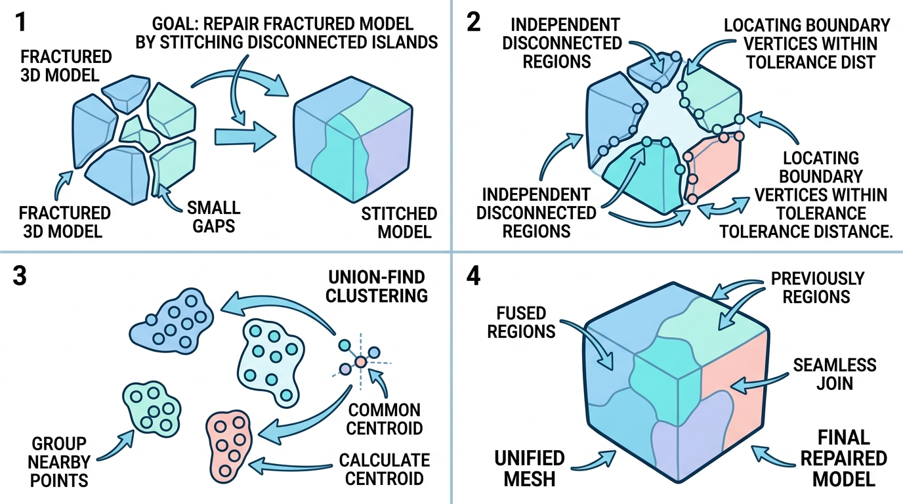

# vtkSHYXDisconnectedRegionFuse

## 示意图

## 1. 目的与功能算法详细解释

**目的与功能**：
在三维网格处理中，存在因精度或建模问题导致模型出现断裂的多个独立区域 (Disconnected Regions)。`vtkSHYXDisconnectedRegionFuse` 的核心功能是**融合距离临近但不相连的网格区域**。该算法的优势在于：**仅融合属于不同区域的相邻顶点，严格保留同一区域内部的拓扑结构**。这使得断裂网格在保持固有特征不受损的前提下实现连接与重组，支持多区域顶点之间的多对多融合。

**算法详细步骤**：
1. **区域标记 (Region Labeling)**：调用 `vtkPolyDataConnectivityFilter` 提取输入网格中的所有连通区域，并赋予各顶点相应的 `RegionId` 属性标签。
2. **分组归类 (Grouping)**：依据 `RegionId` 标签，将所有网格顶点归纳至不同的区域分组内进行独立管理。
3. **跨区匹配 (Cross-Region Matching)**：利用 `vtkStaticPointLocator` 结构实施空间近邻搜索。当来自不同区域的顶点距离低于设定的容差阈值时，算法将其标记为合并候选对（该搜索过程支持 VTK SMP 并行计算）。
4. **并查集聚类 (Union-Find Clustering)**：针对复杂的间接连接关系，使用并查集 (Union-Find) 算法将匹配的合并对划分至同一等价类。聚类操作完成后，合并后的新顶点坐标取该等价类集合内顶点的重心（平均位置）。
5. **拓扑重构 (Topology Update)**：遍历网格中现有的多边形面片 (Polygons)，将面片使用的旧顶点 ID 映射至合并后的统一新 ID。在此阶段，由于多顶点融合而发生退化（顶点数小于 3）的面片结构将被清除。
6. **属性继承 (Attribute Mapping)**：完成几何更新后，维护更新 `PointData` 及 `CellData` 数据。合并产生的新顶点将继承所在等价类首个元素的属性，保留面片层级的原始单元特征。

## 2. 参数列表及其效果和含义

该模块的控制逻辑专注于以下核心参数：

* **`FuseThreshold`** (类型: `double`, 默认值: `0.01`)
  * **含义**：融合距离阈值。
  * **效果**：定义判定跨区域顶点合并的临界欧氏距离。仅当分别从属**不同区域**的顶点之间距离 $\le$ `FuseThreshold` 时，顶点方可合并。
  * **注意事项**：阈值设置过小可能导致本应闭合的缝隙无法成功连接；若设置过大，可能误将无关的特征点错误聚类，造成严重网格穿模或扭曲。建议依据三维模型的实际物理尺度合理调整。