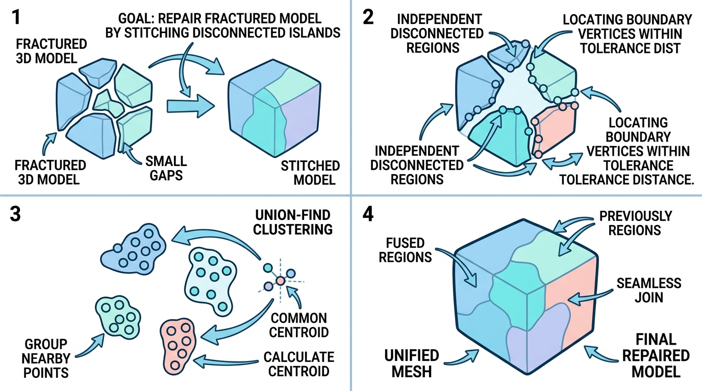

# vtkSHYXDisconnectedRegionFuse

## 示意图

## 1. 目的与功能算法详细解释

**目的与功能**：
将表面、折线或顶点中**互不连通的片**在近处缝合。`vtkSHYXDisconnectedRegionFuse` 接受端口 0 上一路或多路 `vtkPolyData`。**Fuse Within Input**（默认开）时，每路内部按 verts / lines / polys / strips 的**连通域**分域，同一份数据里的断线/断片可以焊上。关掉后，**一路连接 = 一个域**，该路内部的不连通片不合并，只在不同输入之间缝。同一域内的点不会被阈值拉扁。**Fuse Verts / Fuse Lines / Fuse Polys** 决定输出保留哪些单元。

**ParaView 注意**：若要把多个管线节点一起缝，`Input` 必须用 **`AddInputConnection`**。若误用 **`SetInputConnection`**，新接上的线会**替换**掉旧连接。

**算法详细步骤**：
1. **域与全局顶点编号**：各路输入的顶点按连接顺序编成全局 ID。
2. **分域**：`FuseWithinInput` 开：每路内部沿单元边做并查集得到连通域，孤立点各自成域。关：域索引 = 输入连接索引。
3. **跨区匹配**：候选点仍须距离 ≤ `FuseThreshold`。排序代价 = `(1-w)·距离 + w·阈值·(1-顺应性)`。**线**：偏向端点、且连接方向与端点外向切线一致（顺着线往末端延长）。**面**：偏向连接落在切向平面内（不要沿法向去对另一层）。`w=0` 就是原先的纯最近。
4. **连接方式（Fuse Method）**：
   - **Average**：合并两点，新点取中点。
   - **Snap small to large**：合并两点，位置留在点数更多的那一侧。
   - **Construct primitives**：不删点、不合点。线：在最近端点之间加一条新线。面：在两侧各取一条朝向对方的邻边（优先边界边），把这四边形按较短对角线拆成两个三角形；只有一侧能找到邻边时加一个三角形；两边都找不到则退回加一条线。
5. **拓扑重构**：Average / Snap 会映射旧点 ID 并丢掉退化单元。Construct 保留原单元，再追加桥接单元。**Triangle strips 只参与连通域，不写入输出**。
6. **属性继承**：Average / Snap 按焊点代表点拷贝 `PointData`。Construct 每个原点保留自己的点属性；新桥接单元没有源 cell，对应其它 `CellData` 为默认值。输出单元数组 **`SHYXFuseMark`**（并设为活动标量）：`0` 未改动，`1` 原单元用到了被合并的顶点，`2` 新加的桥接单元。

勾选 **Fuse Lines** 时，不同域的折线在端点够近处会**共用顶点**，网格上连通；不会把多条 cell 拼成一条更长的 polyline。只有一路、只有一个域、三个类型开关都开时，才浅拷贝透传。

## 2. 参数列表及其效果和含义

* **`FuseThreshold`** (类型: `double`, 默认值: `0.01`)
  * **含义**：允许桥接的最大缝宽。
  * **效果**：两个不连通域只在**最近顶点对**处焊接，且仅当该距离 ≤ 阈值。调大阈值不会移动已通过的焊点，只会让更远的域对开始连接；调到小于某条缝则那条缝断开。
  * **注意事项**：按缝隙尺度设。过小接不上；两域之间只会焊最近的一处，长缝的其它近点不会一起焊。
* **`ComplianceWeight`** (类型: `double`, 默认值: `0`)
  * **含义**：距离 vs 顺应性的配比，范围 [0,1]。
  * **效果**：`0` 只看欧氏距离。`1` 在阈值球内只按顺应性选（线找末端延长、面找切向）。中间为加权。Construct 选邻边时同样用这个配比。
* **`FuseWithinInput`** (类型: `bool`, 默认值: 开)
  * **含义**：单路输入里的不连通片是否互相融合。
  * **效果**：开 = 按连通域分域（一份断线也能焊）；关 = 一路一个域，只缝不同输入。
* **`FusePositionMode`** (类型: `int`, 默认值: 0 Average)
  * **含义**：最近缝怎么接。
  * **效果**：`0 Average` 合点取中点。`1 Snap small to large` 小域贴到大域顶点。`2 Construct primitives` 不删点，加线或两个桥接三角形。
* **`FuseVerts`** / **`FuseLines`** / **`FusePolys`** (类型: `bool`, 默认值: 开)
  * **含义**：是否把对应单元映射到融合后的点并写入输出。
  * **效果**：关闭则丢弃该类型。连通域（若启用单路融合）仍按全部单元计算。
