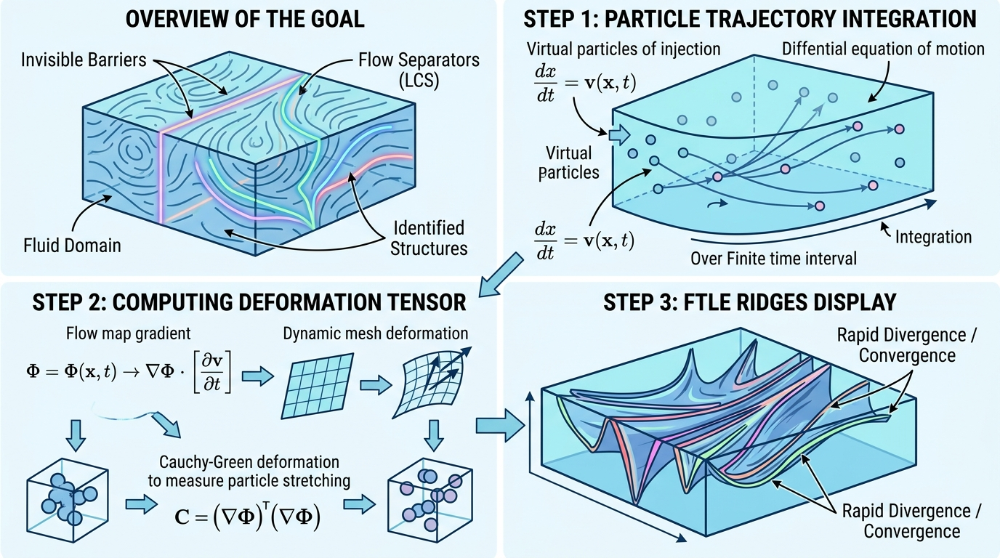

# FTLEFilter: 有限时间李雅普诺夫指数计算器

## 示意图

## 1. 目的与功能算法详细解释

### 目的
`FTLEFilter` 的核心目的在于通过计算**有限时间李雅普诺夫指数 (Finite-Time Lyapunov Exponent, 简称 FTLE)** 分析流场数据，以此定位流场中的分离和汇聚区域，即**拉格朗日拟序结构 (Lagrangian Coherent Structures, LCS)**。正向时间积分能够反映流场的排斥结构，逆向时间积分能够反映流场的吸引结构。

### 算法流程
该模块的工作原理包括以下具体步骤：
1. **速度场插值 (Velocity Interpolation)**：获取流场数据中的速度场矢量，并利用 `vtkCompositeInterpolatedVelocityField` 建立空间中任意点速度矢量的平滑插值机制。
2. **粒子平流 (Particle Advection)**：在流场网格各顶点初始化虚拟粒子，采用设定的数值积分器 (如 RK2 或 RK4)，基于预定义的时间步长 (`StepSize`) 进行给定时间 (`IntegrationTime`) 内的正向或逆向位移积分。
3. **流图生成 (Flow Map Generation)**：粒子积分结束后，收集记录演进结束后的坐标状态，构建流图映射 (Flow Map)。
4. **梯度与张量计算 (Jacobian & Cauchy-Green Tensor)**：使用 `vtkGradientFilter` 解析流图以计算空间梯度（雅可比矩阵 $F$），随后计算出柯西-格林变形张量 $C = F^T F$。此张量量化了相邻粒子初始距离经演化后的变形程度。
5. **FTLE 求解 (FTLE Calculation)**：提取变形张量 $C$ 的最大特征值 $\lambda_{max}$。最终的 FTLE 值根据以下公式计算得出：
   $$ FTLE = \frac{1}{|T|} \ln(\sqrt{\lambda_{max}}) $$
   计算结果将以 `FTLE` 标量数组的形式写入各数据节点，供后续渲染调用。

---

## 2. 参数列表及其效果和含义

以下为该模块可供设定的主要控制参数：

* **`IntegrationTime` (积分时间)**: 
  * *含义*：虚拟粒子在流场中经历的总演化时长。
  * *效果*：决定流场结构解析的尺度。设定为正值计算正向 FTLE（分析排斥特征），负值计算逆向 FTLE（分析吸引特征）。若时间过短结构将不明显，时间过长则可能使粒子越出网格边界。
* **`StepSize` (步长)**:
  * *含义*：数值积分器单步的评估时间长度。
  * *效果*：平衡计算耗时与数值精度。步长减小将提高计算精准度并增加耗时；步长过大易导致轨迹发散失真。
* **`StartTime` (起始时间)**:
  * *含义*：控制平流释放时间的基准标度。
  * *效果*：在使用迹线 (`Pathline`) 模式对随时间变化的非定常流进行分析时，指定粒子释放的具体物理时间点。
* **`IntegratorType` (积分器类型)**:
  * *含义*：计算粒子位移路径的数值积分方法，支持 `INTEGRATOR_RK2` (二阶龙格库塔) 与 `INTEGRATOR_RK4` (四阶龙格库塔)。
  * *效果*：RK4 精度相对更高且适用性更广，作为推荐默认值；RK2 运算开销相对更低，适合快速预览场景。
* **`AdvectionMode` (平流模式)**:
  * *含义*：设定流场的时变特性。提供 `MODE_STREAMLINE` (流线模式，视作定常流) 和 `MODE_PATHLINE` (迹线模式，视作非定常流)。
  * *效果*：静态数据集须选择 Streamline 模式；如果流场具有多个时间切片且需反映真实演化，则须选用 Pathline。
* **`VelocityArrayName` (速度数组名)**:
  * *含义*：输入数据集内指示流速的矢量数组名称。
  * *效果*：若留空，系统将尝试寻找数据集中被激活的默认矢量；若显式提供错误名称，则滤镜抛出错误提示。