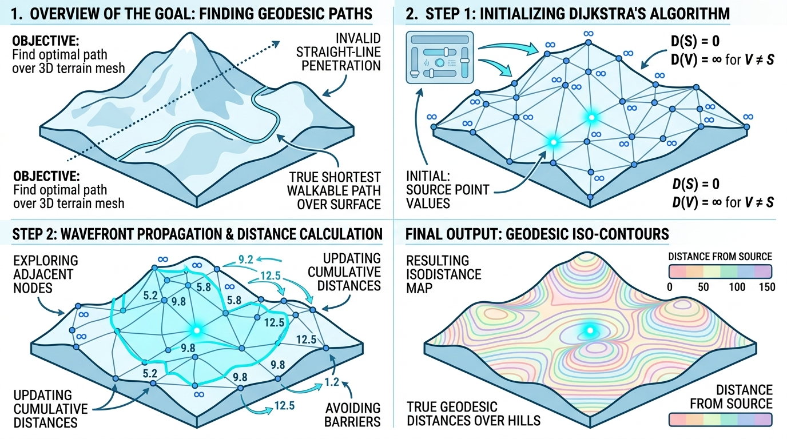

# Geodesic Distance Filter (测地线距离计算器)

## 示意图

## 1. 目的与功能算法详细解释

### 目的
在三维网格表面分析中，两点之间的欧几里得直线距离往往无法准确反映真实的表面几何拓扑。`vtkGeodesicDistanceFilter` 的主要任务是计算**表面测地线距离 (Geodesic Distance)**，即沿着表面网格多边形，从指定的源顶点 (Source Vertex) 出发，到达网格内其他顶点的最短路径长度。

### 功能与算法原理
该模块的底层路径搜索依赖于 **Dijkstra 算法**：
1. **数据准备**：模块初步检查输入数据，确认输入是否为包含多边形面片 (Polygons) 拓扑结构的 `vtkPolyData` 对象。
2. **图的构建与搜索**：内部调用 `vtkDijkstraGraphGeodesicPath`，将三维表面网格映射为加权无向图 (Graph)。其中网格边映射为图的边，几何边长作为边的权重。
3. **全局波前传播**：滤镜默认关闭 "找到终点即停止" (`StopWhenEndReachedOff`) 策略，这使得 Dijkstra 算法能够从源顶点对全图进行广度优先扩展，直至计算出抵达连通图内所有顶点的最短路径距离。
4. **输出结果**：计算完成后，在输出数据集的点属性 (Point Data) 中新增名为 `GeodesicDistance` 的标量数组，并将其置为默认活动状态。对于不连通的孤立顶点，其距离值将被标记为 `-1.0`。

## 2. 参数列表及其效果和含义

本模块的主要控制参数如下：

| 参数名称 | 数据类型 | 含义与效果 | 默认值 |
| :--- | :--- | :--- | :--- |
| **`SourceVertexId`** | `vtkIdType` (整数) | **源顶点 ID**。 定义测地线计算的起始点。须提供有效的输入顶点索引，如果输入的顶点总数为 N，则参数值必须位于 `[0, N-1]` 之间。若设置越界索引，模块将抛出错误。 | `0` |

*注：除此之外，模块作为标准 VTK 滤镜管线节点（1个输入端口，1个输出端口），底层将自动处理边权重累加与图节点的生成分配。*