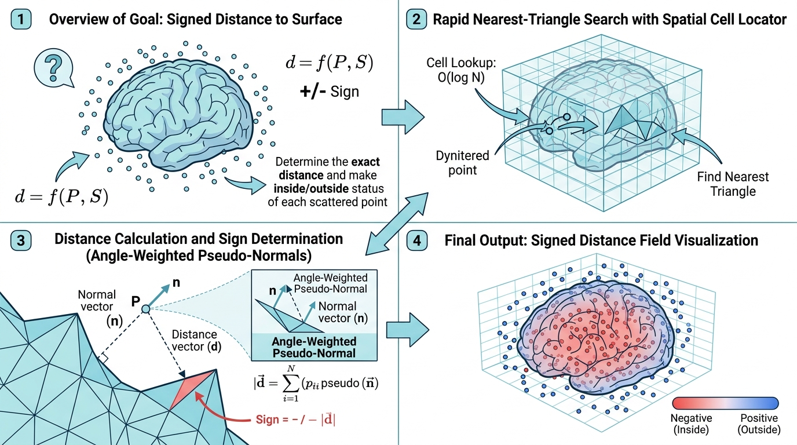

# PointCloudSurfaceSDF (点云到曲面有符号距离场计算)

## 示意图

## 1. 目的与功能算法详细解释

### 🎯 目的与功能
本模块的核心功能是计算离散点云 (Point Cloud) 到参考三维曲面 (Reference Surface) 的**有符号距离场 (Signed Distance Field, SDF)**。
给定输入点云集和参考曲面网格，算法将计算出每个离散点至参考曲面的最短空间距离，并根据点的空间位置分配正负号（正值表示位于曲面外部，负值表示位于曲面内部）。计算结果将以 `SDF` 为名输出为一个单通道数组，并附加在点云数据的 `PointData` 中，供后续碰撞检测、网格重建或渲染分析使用。

### 🧠 算法解析
算法在底层通过 VTK 的几何距离评估类实现计算：
1. **空间定位引擎**：核心依赖 `vtkImplicitPolyDataDistance` 过滤器。该类通过构建单元定位器 (Cell Locator) 来加速空间搜索，以快速定位距离每个测试点最近的曲面网格单元。
2. **伪法线加权 (Angle-weighted Pseudonormals)**：利用面积/角度加权的伪法线技术进行距离符号的判定。该方法能够良好地处理存在锐利折角或非完美闭合流形 (Non-manifold) 的表面模型，有效减少因法线不连续而导致的距离场伪影。若输入曲面未提供面法线 (Cell Normals)，底层管线将自动计算法线。
3. **多线程并发**：在计算规模巨大的点云距离场时，算法使用 `vtkSMPTools::For` 将点云数据分块，利用多线程并发执行距离评估函数 (`EvaluateFunction`)，大幅缩短整体计算耗时。

## 2. 参数列表及其效果和含义

该模块采用标准 VTK 管道接口，无复杂的可调参数。相关接口定义如下：

| 端口/方法名称 | 数据类型 / 作用 | 效果与含义 |
| :--- | :--- | :--- |
| **Input Port 0**  *(点云数据)* | `vtkPolyData` | 待求值的散乱点云集合。算法将逐点评估它们与参考曲面之间的距离并赋予 SDF 标量值。该输入项必须提供。 |
| **Input Port 1**  *(SetSourceConnection)* | `vtkPolyData` | 参考曲面数据。必须是包含面片拓扑结构 (Cells) 的网格对象。若输入的 `vtkPolyData` 不包含任何面片数据，管线将抛出 `Surface has no cells.` 的错误并中断执行。 |
| **输出数组 (SDF)** | `vtkFloatArray` | 计算的最终产出。结果输出的点属性 (`PointData`) 中将新增或更新一个名为 `SDF` 的单通道浮点数组，记录各点对应的有符号距离。 |