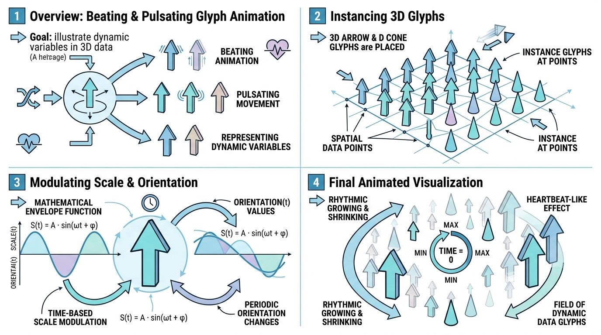

# PulseGlyphRepresentation — Pulse Glyphs

Display 下拉 **`Pulse Glyphs`**。不要 `PulseGlyphRepresentation()`。Python：`GetDisplayProperties().Representation = 'Pulse Glyphs'`，属性用 **`PG_*`**（如 `disp.PG_Animate`、`PG_OverallScale`）以及继承的 `PulseGlyph_GlyphType` / LOD。

## 示意图

## 1. 目的与功能算法详细解释 🧠

### 核心目的
本模块旨在提供一种支持**随时间动态脉动效果**的三维图元 (Glyphs) 渲染表示 (Representation)。该模块继承自 `vtkGlyph3DRepresentation`，通过在管线中动态驱动 `vtkGlyph3DMapper` 的缩放 (Scale) 与旋转 (Orientation) 属性，使得点云或矢量场数据伴随时间或帧数呈现出周期性的脉冲动画效果。

### 工作原理与算法
动态表现的底层逻辑基于一套相位包络 (Phase Envelope) 算法：
1. **动画驱动器**: 借助 `ParaViewPlugin/pqPulseGlyphAnimationManager` 统筹管理，当视图中包含开启了 `PG_Animate` 的脉冲图元时，管理器将连续触发视图重绘 (`view->render()`)，以生成连续的动画帧。
2. **混合相位计算 (Mix Value)**: 读取 `AnimationCoordinateArray`（找不到则用到原点的点半径）× `IntegrationScale`，再加 **renderFrame × TimeScale**（不是墙钟时间）。
3. **包络函数 (Envelope)**: 相位小数部分经 `Trunc` 钳制到 `[0, 1]`，再 `1.0 - pow(clamped, Pow)`。
4. **变换映射**:
   - **缩放**: 受 `PulseAffectsScale` 门控；可叠加 ExtraScaleArray。
   - **旋转**: 包络 × `RotationSweep`。`Shuffle` 用 `std::minstd_rand`，种子来自 mixValue。

---

## 2. 参数列表及其效果和含义 🎛️

本表示模块提供的核心配置参数如下：

| 参数名称 | 类型 | 含义与效果 |
| :--- | :---: | :--- |
| **PG_Animate** | `bool` | **动画总开关**。 |
| **TimeScale** | `double` | **时间缩放系数**。控制脉冲动画随时间演化的频率与速度。 |
| **IntegrationScale** | `double` | **空间频响**。作为空间坐标或目标数组的乘数，控制脉冲状态在空间分布上的密集度与变化率。 |
| **Trunc** | `double` | **截断因子**。决定脉冲包络的波形截断占比，控制图元处于极值状态的时长比例。 |
| **Pow** | `double` | **衰减指数**。控制脉动强度衰减曲线的平滑度（线性或指数级衰减）。 |
| **PulseOverallScale** | `double` | **全局缩放系数**。图元计算得出的最终动态缩放量都将乘以该全局系数。 |
| **AnimationCoordinateArray**| `string` | **相位源数组**。指定用于驱动空间相位的点数据数组名称（默认值为 `IntegrationTime`）。若未找到，算法将默认使用空间坐标计算。 |
| **ExtraScaleArray** | `string` | **附加缩放数组**。指定另一个数据数组，其数值大小将额外作用于图元的基准缩放。 |
| **ArrayAffectScale** | `bool` | **附加缩放使能**。是否允许 `ExtraScaleArray` 参与最终的缩放计算。 |
| **ArrayAffectScaleRatio** | `double` | **附加缩放比率**。定义额外数组的幅值影响基础缩放的权重系数。 |
| **PulseAffectsScale** | `bool` | **缩放脉动使能**。设置时间脉冲包络是否作用于图元的尺寸变化。 |
| **PulseAffectsRotation** | `bool` | **旋转脉动使能**。设置时间脉冲包络是否作用于图元的姿态旋转。 |
| **Shuffle** | `bool` | **随机离散模式**。开启后，将引入伪随机偏差以打破统一的同步演化，使每个图元呈现独立的脉动和旋转状态。 |
| **RotationSweep** | `double[3]`| **最大旋转欧拉角**。定义脉冲作用在 X, Y, Z 三轴上允许达到的最大旋转角度范围。 |