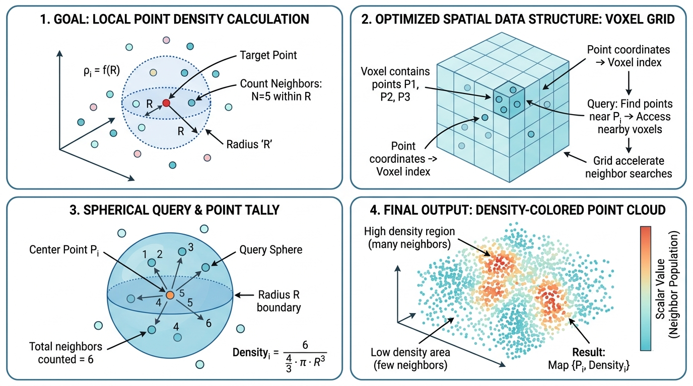

# RadiusNeighborCount (固定半径邻域点计数)

## 示意图

## 1. 目的与功能

`vtkSHYXRadiusNeighborCount` 是基于 VTK (Visualization Toolkit) 的点云分析过滤器（继承自 `vtkPolyDataAlgorithm`）。该模块的主要目的是：**针对点云中的每个顶点，统计其在指定的搜索半径内包含的邻域点数量**。

具体而言，给定一个 `vtkPolyData` 输入，算法将遍历每一个顶点，并以该顶点为球心、给定的 `Radius` 为半径进行闭球搜索（包含中心查询点自身），从而精确计算该局部邻域内的邻居顶点总数。

处理完成后，算法不会修改原有的几何和拓扑结构，而是通过浅拷贝（Shallow Copy）保留输入数据，并在输出结果的点属性（Point Data）中新增一个 `vtkIdTypeArray` 类型的数组——`NeighborsInRadius`。每个顶点的邻居计数值将存储于此，便于下游管线进行局部密度估计或异常点剔除前的特征评估。

## 2. 算法原理解析

为了高效处理高密度的点云数据，该算法整合了以下优化机制：

1. **高效空间索引 (`vtkStaticPointLocator`)**：
   在正式执行邻域查询前，算法会为输入点云构建高性能的静态点定位器 (Static Point Locator)。这种数据结构将空间离散化为规则的网格桶，避免了全局的暴力距离遍历，使算法能够快速圈定潜在邻居点的搜索范围。
2. **多线程并发加速 (`vtkSMPTools`)**：
   算法使用 VTK 的对称多处理工具 (`vtkSMPTools::For`) 对统计流程进行加速。查询任务被均匀划分为多个批次，并派发给多核 CPU 并发执行。在此过程中，使用线程本地对象 (`vtkSMPThreadLocalObject<vtkIdList>`) 管理临时数据，有效消除了多线程环境下的资源竞态，确保内存访问的安全性与高效性。

## 3. 参数列表及其含义

| 参数名 | 类型 | 默认值 | 效果与含义 |
| :--- | :--- | :--- | :--- |
| **`Radius`** | `double` | `1.0` | **邻域搜索半径**。本算法的核心控制参数，定义了计算局部密度的物理球体半径。  - **效果**：半径值越大，所包含的邻居点数量也越多，相应的搜索计算开销将增加；半径越小，计算出的局部密度越趋近于个体离散状态。  - **约束**：须指定为一个大于 `0.0` 且有限 (Finite) 的正浮点数，否则算法将抛出异常并中断执行。 |

*(注：输出数据集中的属性数组名称固定硬编码为 `NeighborsInRadius`，作为后续数据提取与映射的标准名称。)*