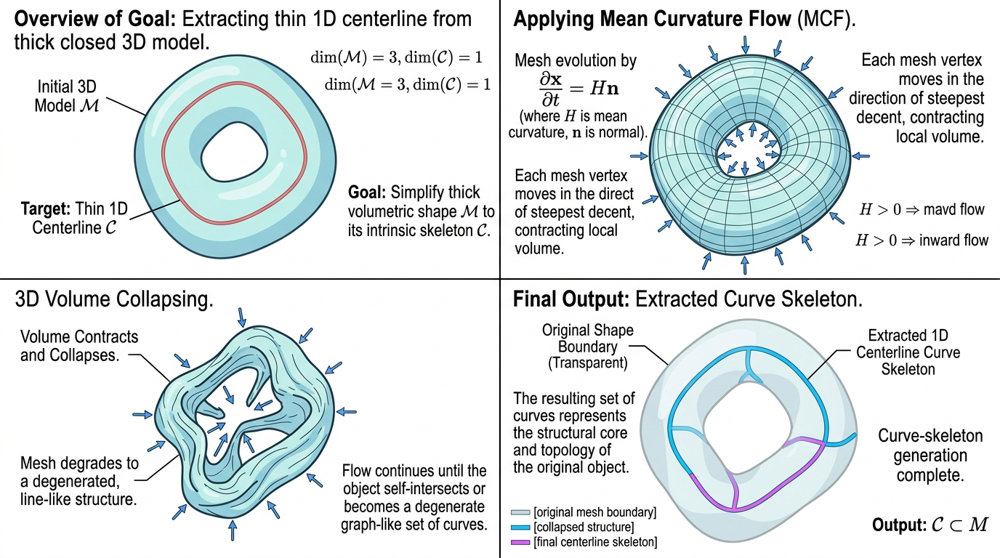

# 🦴 SkeletonExtraction (3D骨架提取)

## 示意图

## 1. 目的与功能算法详细解释

**目的**： 
本模块的核心功能是从闭合的 (Watertight) 3D 三角表面网格中，计算并提取出其对应的一维曲线骨架 (1D Curve Skeleton)。算法输出结果为由多段线 (Polylines) 构成的 `vtkPolyData` 对象，可用于模型分析、骨骼绑定与形状检索。

**算法与流程**： 
底层计算依赖于 **CGAL (Computational Geometry Algorithms Library) 的平均曲率流骨架化 (Mean Curvature Flow Skeletonization)** 算法。整体处理工作流包括以下步骤：
1. **数据结构转换**：将输入的 VTK `vtkPolyData` 数据结构转换为 CGAL 所支持的表面网格 (Surface Mesh) 结构。
2. **连通性与闭合性验证**：严格验证输入网格的闭合状态。非闭合或非流形的模型不满足该骨架化算法的输入要求。
3. **曲率流收缩 (Contraction)**：利用平均曲率流迭代作用于表面网格。在此过程中，表面沿法向向内部收缩，直至网格坍缩收敛为一维的骨干结构。
4. **图结构转换与输出**：将 CGAL 提取出的一维骨架图结构（包含顶点与边连接关系）重构为 VTK 的多段线单元 (`vtkPoints` 及 `vtkLine`)，并输出至管线。

---

## 2. 参数列表及其效果和含义

以下为控制骨架提取过程的核心参数：

| 参数名 | 类型 | 默认值 | 含义与效果 |
| :--- | :---: | :---: | :--- |
| **MaxTriangleAngle** | `double` | 110.0 | **最大三角形角度 (度)**。在曲率流收缩过程的局部重网格化 (Remeshing) 中，内角超过此值的退化三角形将被拆分，以维持数值计算的网格质量。 |
| **MinEdgeLength** | `double` | **0.002×包围盒最长边** | **最小边长限制**。局部重网格化过程中，长度短于该值的边缘会被执行折叠操作。自动规则为输入**轴对齐包围盒最长边**的 **0.002** 倍，与 ParaView 内置 `vtkSMBoundsDomain` 的 `scaled_extent`（`scale_factor=0.002`）一致；属性默认 `0` 与手动填 `0` 均表示自动。ParaView 属性面板会在该数值旁显示与 Stream Tracer 等滤镜相同的**缩放**与**按数据重置**控件。仅 **大于 0** 时按该绝对长度使用。 |
| **MaxIterations** | `int` | 500 | **最大迭代次数**。限制平均曲率流收缩步骤的最高循环次数。此参数用于防止在某些复杂几何体上出现无法收敛的过度计算耗时。 |
| **AreaThreshold** | `double` | 1e-4 | **面积阈值比率**。控制收缩的终止条件。当收缩后网格的总表面积与初始表面积的比值小于此阈值时，迭代将停止。 |
| **QualitySpeedTradeoff** | `double` | 0.1 | **质量与速度的权衡系数 (w_H)**。较小的值能够提升系统收敛速度，但提取出的骨架平滑度可能下降；较大的值有助于提高骨架的最终拓扑和几何质量。 |
| **MediallyCentered** | `bool` | true | **是否居中计算**。启用该项后，算法将在收缩的后期施加排斥力，计算严格居中于原始模型几何内部的骨架曲线。 |
| **MediallyCenteredSpeedTradeoff**| `double` | 0.2 | **居中平滑度权衡 (w_M)**。仅在开启 `MediallyCentered` 时有效。较高的值能够使生成的骨架更加逼近精确的内侧轴 (Medial Axis)，但也可能适度增加迭代收敛的耗时。 |