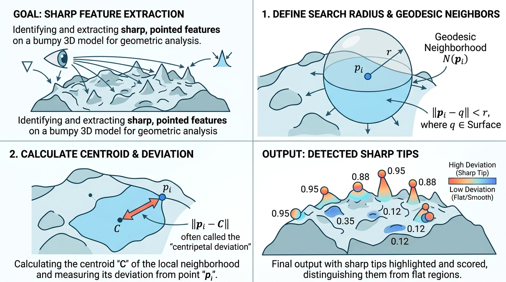

# SurfaceTipExtractor 尖端提取器

## 示意图

## 1. 目的与功能算法详细解释

**目的**： 
`vtkSurfaceTipExtractor` 是一个专用于分析 3D 表面模型特征的模块，用于检测和量化表面网格中的尖锐突起或局部极值点（如树冠顶端、圆锥顶点等尖锐特征）。该模块通过为表面（`vtkPolyData`）的各个顶点计算“锐度得分 (TipScore)”，以此量化顶点的几何尖锐程度。得分较高的点代表其处于凸起的尖端区域，而得分极低或趋近于 0 的点则位于平缓或均匀区域。

**算法流程**：
该算法通过分析顶点的局部连通邻域几何特征进行评估，具体流程如下：
1. **构建空间邻域**：针对表面上的待测顶点 $P_i$，以该点为球心、指定的 `SearchRadius` 为半径进行球形空间检索，利用点定位器 (Point Locator) 获取落入范围内的候选顶点集合。
2. **建立测地线连通邻域**：在候选顶点集合中，通过广度优先搜索 (BFS) 沿网格边 (Edges) 与面片拓扑进行连通性验证。仅保留与待测点 $P_i$ 在拓扑上连续且连通的邻居顶点，从而排除单纯由于空间距离接近但拓扑上不相关的区域。
3. **计算邻域几何中心**：汇总上述提取的有效测地连通邻域顶点，计算其平均坐标以得出局部区域的几何重心 (Centroid)。
4. **评估偏移得分**：计算待测顶点 $P_i$ 至邻域几何重心之间的欧氏距离。如果顶点位于平缓面内，其邻域分布对称，重心极度贴近顶点自身；反之，若顶点处于尖刺结构的顶端，邻域顶点单向延伸，重心将显著偏离原顶点。偏离的欧氏距离即作为该顶点的锐度度量值，记录于 `TipScore` 中。

---

## 2. 参数列表及其效果和含义

该模块提供如下参数用于控制提取算法的作用范围：

| 参数名 | 类型 | 默认值 | 含义与效果 |
| :--- | :--- | :--- | :--- |
| `SearchRadius` | `double` | `5.0` | **搜索半径**。定义提取顶点局部邻域特征的物理搜索范围。  👉 **效果说明**： - **半径过大**：评估基于大尺度网格面貌，可能只捕捉到宏观的形体尖端，而掩盖掉局部的细小突起特征。此外，扩大的遍历连通邻域范围将显著增加 BFS 搜索的耗时。 - **半径过小**：评估过于敏感，易受模型局部网格噪声干扰。如果设定的半径小于网格单元的平均边长，连通邻域将仅包含该顶点自身，从而导致所有的得分均归零。 💡 *建议依据 3D 模型的整体包围盒尺寸，及所需提取特征的目标尺度灵活调试该参数。* |

*(注：该过滤器的输出为拓扑结构不变的 `vtkPolyData`，并在点的属性数据 `PointData` 中增设名为 `TipScore` 的双精度浮点标量数组。)*