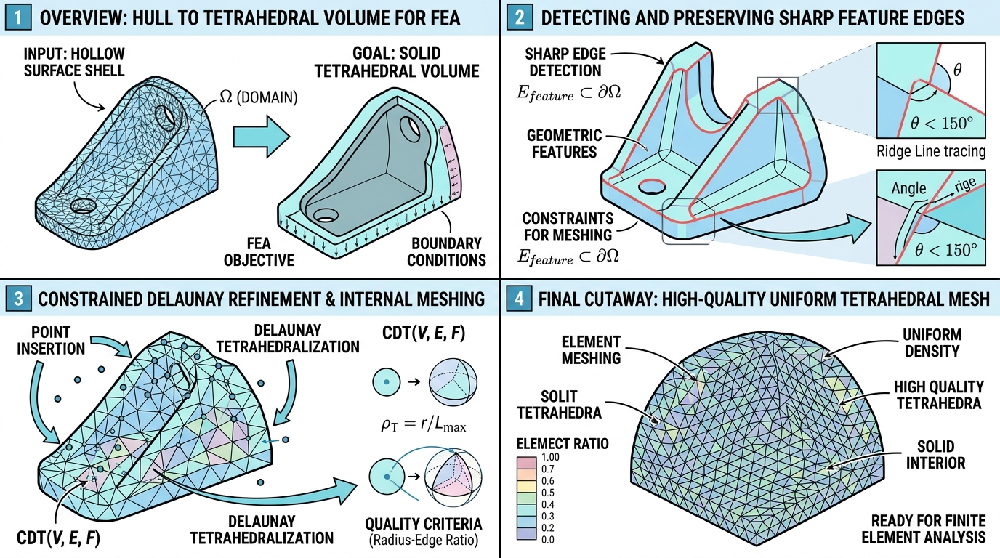

# vtkCGALSurfaceToVolumeMesh (曲面到体网格生成器)

## 示意图

## 1. 目的、功能与算法详述

**🎯 目的与功能：**
在有限元分析及相关科学计算领域中，模型数据常常以封闭表面网格的形式提供。`vtkCGALSurfaceToVolumeMesh` 模块的主要功能是将完全由三角形组成的封闭流形表面网格（`vtkPolyData`）转化为实心的、由四面体单元构成的三维体积网格（`vtkUnstructuredGrid`）。

**🧠 核心算法（Delaunay Refinement）：**
该模块的底层计算高度依赖于 **CGAL (Computational Geometry Algorithms Library)** 几何算法库，特别是其三维网格生成包 `Mesh_3`。
- **输入要求：** 提供的三维表面网格必须是严格闭合 (Watertight/Closed) 的流形结构，且不能包含几何自相交现象。
- **算法流程：** 首先，算法将 VTK 格式数据转译为 CGAL 所支持的带特征的三维网格域 (`Polyhedral_mesh_domain_with_features_3`)。随后，执行 **受限三维 Delaunay 细化算法 (Delaunay Refinement)**。该算法通过在表面与体内迭代插入新顶点 (Steiner Points)，并维持 Delaunay 剖分特性，使得生成的四面体网格精确匹配原始表面边界，同时其内部单元的体积大小与长宽比严格遵循预先配置的质量约束标准。

---

## 2. 参数列表及其效果和含义

本模块提供了多种参数以精确控制生成网格的密度与几何质量：

| 参数名 | 默认值 | 含义与效果描述 |
| :--- | :---: | :--- |
| **`FacetAngle`** | 25.0 | **表面面片最小内角（度）：** 控制边界面片的形状质量下限。数值越小，算法在拟合复杂几何形貌时可生成的网格边界越密集。 |
| **`FacetSize`** | 0.15 | **表面面片最大尺寸：** 设定表面三角形的外接圆半径上限。较小的数值会使得表面网格剖分得更为密集。 |
| **`FacetDistance`** | 0.008 | **表面逼近误差限制：** 定义表面三角形的外心到其表面 Delaunay 球心之间的最大允许偏离距离。该参数决定生成的网格表面与原始理想平面的贴合精度，数值越小误差控制越严格。 |
| **`CellRadiusEdgeRatio`** | 3.0 | **四面体形状质量限制：** 四面体单元外接球半径与其最短边长的比值上限。该约束用于限制过度狭长或极度退化的四面体生成。**注意：** 该值必须设定大于 2.01，否则算法可能因无法满足条件而无法收敛。 |
| **`CellSize`** | 0.0 | **四面体最大尺寸限制：** 控制内部四面体外接球的半径上限。设为 `0.0` 时算法不施加显式限制（内部网格体积由表面密度自然扩展）；设定为大于 0 的数值将强制约束最大体积，以获得更为致密的内部空间网格。 |
| **`DetectFeatures`** | ON | **特征边检测开关：** 启用后，算法会在剖分前对输入模型中的尖锐边与硬特征角进行探测并加以保护。针对纯圆滑且无明显几何棱角的模型（如理想球体），可将其关闭以减少前处理耗时。 |
| **`FeatureAngle`** | 60.0 | **特征角阈值（度）：** 用于特征边识别。当相邻两表面的法线夹角大于等于此阈值时，该公共边将作为特征边界予以保护保留。*仅在 `DetectFeatures` 为 ON 时生效。* |
| **`EdgeSize`** | 0.0 | **特征边采样最大长度：** 控制特征边上的分段节点采样密度。数值越小，尖锐边缘上的插值顶点越密集。设为 `0.0` 表示无显式边界长度约束。*仅在 `DetectFeatures` 为 ON 时生效。* |