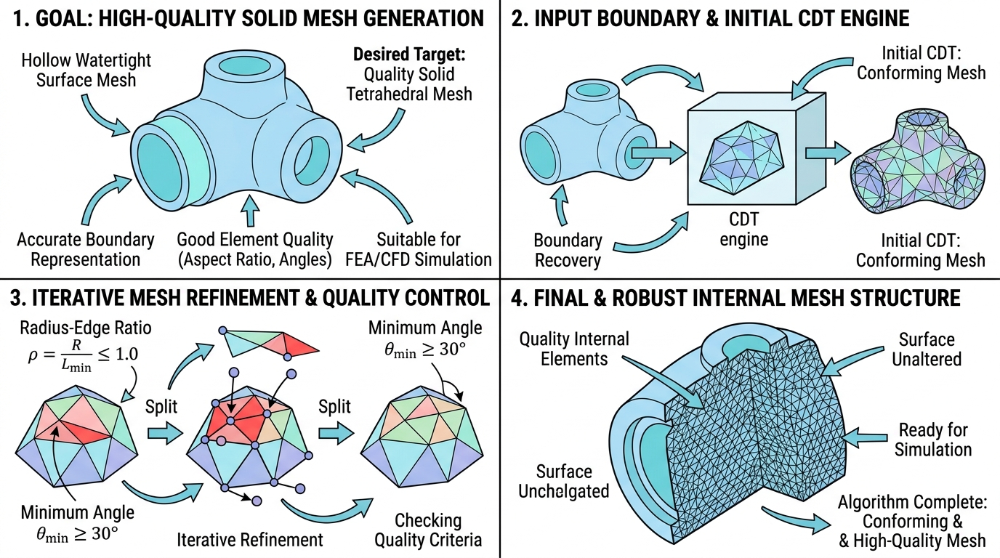

# TetGen (vtkSHYXTetGen)

## 示意图

## 1. 目的与功能算法详解 (Purpose & Algorithm)

`vtkSHYXTetGen` 是一个主要用于执行三维网格生成的过滤器 (Filter)。其核心目标是将**封闭的三维表面网格**转换为实心的**四面体体积网格**。

**核心目的**：
该模块接收一个必须保持封闭且水密 (Watertight) 状态的表面三角面片数据（`vtkPolyData`），并在其内部填充生成高质量的实体四面体网格数据（`vtkUnstructuredGrid`）。若输入的表面网格存在破洞、自相交等拓扑错误，模块将无法完成网格化计算并抛出异常。

**底层算法**：
本模块基于 **TetGen** 库进行开发封装，核心采用**约束 Delaunay 四面体化 (Constrained Delaunay Tetrahedralization, CDT)** 算法。
其基本工作流程为：
1. **数据解析**：将传入的 VTK 表面三角面片数据解包并转换为 TetGen 内部计算所支持的域定义结构。
2. **四面体化填充**：利用 Delaunay 算法规则在三维空间中执行节点重连，保证生成的四面体具备良好的长宽比分布，从而避免狭长或退化的几何单元产生。
3. **约束兼容性**：算法在生成内部四面体的同时，需要评估是否保留原始表面网格节点。这通常取决于表面特征约束规则（是否允许插入新的 Steiner 顶点以优化表面形貌）。
4. **输出装配**：将 TetGen 输出的网格坐标与单元结构重组为 VTK 兼容的非结构化网格。

---

## 2. 参数列表及其效果与含义 (Parameters)

以下参数直接对应 TetGen 算法库中的各个控制标记（Switch），用于调节最终的网格输出质量与特性：

| 参数名 | 默认值 | 对应TetGen开关 | 含义与效果 |
| :--- | :---: | :---: | :--- |
| **MaxVolume** | `0.0` | `-a` | **最大四面体体积限制**。若设定为大于 0 的数值，算法将对体积过大的四面体进行强制细分以满足要求。设为 0 表示不启用体积约束。 |
| **MaxRadiusEdgeRatio** | `1.8` | `-q` | **最大半径边缘比**。控制网格形状质量的关键指标，定义为四面体外接球半径与最短边长的比值上限。数值越小，要求四面体越趋近规则四面体。启用该功能时数值必须 `≥ 1.2`；设为 0 时取消约束。 |
| **MinDihedralAngle** | `0.0` | `-q` | **最小二面角限制（度）**。辅助控制网格质量的参数，限制四面体面与面之间的最小夹角以消除扁平畸形单元。生效区间为 `0` 到 `90` 度；设为 0 时取消限制。 |
| **Nobisect** | `ON` | `-Y` | **禁止插入表面顶点**。开启此项后，算法严格保留输入模型的表面三角面片，不会在表面或边界上插入额外的顶点 (Steiner Points)，保证原始拓扑被完整保留。 |
| **UseCDT** | `OFF` | `-D` | **采用边界质量约束细分**。该选项与 `Nobisect` 参数功能互斥。激活后，算法可以在兼顾表面约束的条件下进一步细分表面网格并优化质量。 |
| **CDTRefine** | `7` | `-D#` | **表面 CDT 细分级别**。此参数的调整区间通常为 1 至 7，仅在 `UseCDT` 开启时生效。数值越大表明边界网格的细分程度与精度越高。 |
| **DoCheck** | `OFF` | `-C` | **几何一致性校验**。启用后，TetGen 将在运算结束前检查网格的拓扑有效性，排查是否存在重叠面、自交叉等劣质几何结构。 |
| **Epsilon** | `1e-8` | `-T` | **共面测试容差系数**。浮点计算过程中的微小容差值，主要用于几何判定中确定多个点或面是否处于相同的空间平面。 |