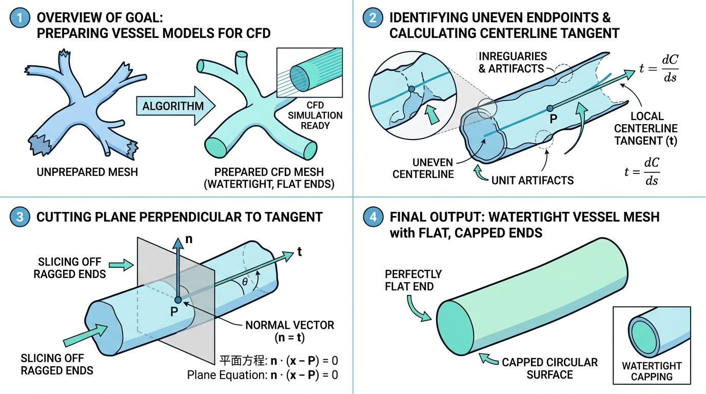

# VesselEndClipper (血管端点裁剪器)

## 示意图

## 1. 目的与功能算法详细解释

### 核心目的
在三维医学图像重建或流体力学前处理中，提取的血管模型末端往往呈现不规则、不平滑的粗糙边界。这通常会导致计算流体力学 (CFD) 仿真中边界条件的设定失败。`vtkCGALVesselEndClipper`（模块 NAME `vtkSHYXVesselEndClipper`）的主要任务是自动检测血管的三维表面网格末端（出入口区域），并生成法向准确、边缘平坦的截断面，从而输出满足 CFD 仿真要求的闭合并水密的网格 (Watertight Mesh)。输入：表面 + Centerline。输出：端口 0 Clipped Mesh；端口 1 Clip Planes（默认 **Point Label**）。交互切平面 widget：`shyx_endclipper_plane_handles`。

### 算法工作流
血管端点的平滑裁剪涉及以下关键计算步骤：

1. **邻接图构建 (Graph Construction):** 算法遍历与血管网格匹配的三维中心线 (骨架数据)，将其拓扑关系解析为点与边连接的邻接图 (Adjacency Graph) 数据结构。
2. **端点检测与切向估计 (Endpoint Detection & Tangent Estimation):** 通过解析邻接图，算法筛选出所有度数 (degree) 为 1 的节点，认定为血管的物理端点。针对每个端点，算法向血管内部反向回溯一定步数（基于 `TangentDepth` 参数），结合回溯路径计算其局部切线矢量。该切向矢量即作为后续平面切割所需的**裁剪法向量**。
3. **拓扑感知裁剪 (Topology-aware Clipping):** 算法利用上一步求得的法向量及端点位置构建无限大的切割平面，并对网格执行空间裁剪。为了避免无限大平面误切到空间折叠的其他血管片段，算法进一步引入连通性分析 (Connectivity Analysis)。系统仅移除与当前端点距离最近并具有直接连通性的切割部分，对其他非相关分支的切割结果予以撤销并恢复，保证整体几何拓扑稳定。
4. **末端封口重构 (Capping):** 若启用 `CapEndpoints`，截断产生的开放边界用 CGAL `triangulate_refine_and_fair_hole` 封口（`FairingContinuity` 0/1/2），不是单纯平面多边形填充。

## 2. 参数列表及其效果和含义

以下为调节端点裁剪与处理行为的核心参数：

| 参数名称 | 默认值 | 含义与效果 |
| :--- | :--- | :--- |
| **`ClipOffset` (裁剪偏移量)** | `0.0` | 设置切割平面沿计算法线方向的位移。正值表示切割面远离血管内部（向外移动，保留更多边缘几何）；负值表示切割面向血管深处偏移（常用于避开端点极度扭曲或畸形的区域以获取更好的横截面）。 |
| **`TangentDepth` (切线探测深度)** | `1` | 限定参数范围 `[1, 10]`。指定算法沿中心线向内回溯探测的节点步数。数值越大，计算出的切向量越综合，受局部不规则结构影响较小；数值越小，切割方向则越倾向于贴合端点极近处的瞬时方向。对于曲率极大的血管末梢建议适度增加探测深度。 |
| **`CapEndpoints` (端点封口)** | `true` | 是否对横截口做 CGAL hole-fair 封口。推荐导出 CFD 前保持开启。 |
| **`MinBranchLength`** | `0` | 短于该中心线弧长的端点默认不勾选；0 = 全部勾选。 |
| **`EndpointSelection` (端点选择列表)** | - | 动态复选框。系统列举端点索引，允许排除特定端点。 |