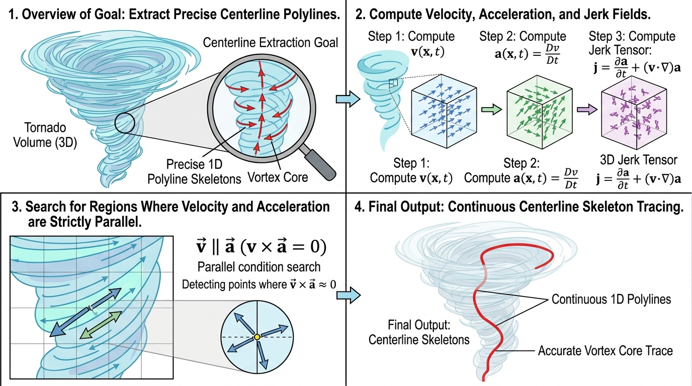

# VortexCoreTest 核心算法解析指南

## 示意图

## 1. 目的与功能算法详细解释

**目的**：
`vtkVortexCoreTest` 是一个用于在三维向量场（典型应用于流体速度场）中分析并提取涡核中心线的过滤器 (Algorithm Filter)。该模块继承并增强了基于平行向量算法 (Parallel Vectors Algorithm) 的标准 `vtkVortexCore` 实现。其核心目标是在复杂流场数据中自动识别、提取并输出能够直观表征三维涡管演化趋势的几何骨架多段线 (Polylines)。

**功能与算法核心**：
该算法的数理逻辑建立在流体动力学量与运动学量的方向一致性分析之上，具体流程由两部分级联组成：

1. **场量评估与平行向量提取**：
   - **基础推导模式**：算法首先计算速度场 (Velocity, $v$) 和对应的加速度场 (Acceleration, $a = J \cdot v$，其中 $J$ 代表速度梯度的雅可比张量)。根据 Sujudi-Haimes 理论，流场中局部加速度场与速度场平行的区域即被判定为涡核骨架的候选集。
   - **高阶衍生模式 (Higher Order Method)**：在更高精度的分析场景中，通过计算“加加速度”场 (Jerk, 即加速度的物质导数) 来优化判据。该步骤涉及计算三维雅可比矩阵的空间梯度张量（含 27 个分量）。在此模式下，系统寻找的平行对被替换为速度场 $v$ 与高阶的 Jerk 场之间的平行位置。

2. **涡旋准则校验与过滤 (Vortex Criteria Filtering)**：
   基于平行理论求出的几何中心线可能会包含非漩涡流动产生的伪影区域。为提高识别准确率，算法进一步对提取网格点实施了四类主流流体力学涡旋准则校验：
   - **Q-Criterion ($Q > 0$)**：评估流场旋转率张量范数是否占优于应变率张量范数。
   - **$\Delta$-Criterion ($\Delta > 0$)**：要求特征矩阵的特征根在特征方程分析中具备复数解（表征旋转物理机制）。
   - **$\lambda_2$-Criterion ($\lambda_2 < 0$)**：识别具有局部动压极小值的相关区域。
   - **$\lambda_{ci}$-Criterion**：计算特征复数解的虚部，作为刚体旋转强度大小的辅助判据。
   
   未能满足上述综合准则的点将被剔除（`acceptedPoints` 置为 false）。同时，系统支持计算并在顶点属性中输出对应的标量涡量大小 (Vorticity Magnitude)。

## 2. 参数列表及其效果和含义

该提取器提供以下可调选项，以满足不同的分析精度与性能要求：

| 参数名称 | 类型 | 默认值 | 效果和含义 |
| :--- | :---: | :---: | :--- |
| `HigherOrderMethod` | `bool` | `false` | **高阶计算模式开关**。关闭状态下，基于传统平行向量逻辑检索速度场与**加速度场**方向一致的线素；开启时，采用三阶梯度张量推演，检测速度场与**加加速度场 (Jerk)** 平行的线段。 **效果**：此模式通过高阶物理量的空间关联可过滤更多非物理干扰并提取更精确的核心骨架，但这将显著增加张量乘法与梯度矩阵求解相关的运算时间开销。 |
| `FasterApproximation` | `bool` | `false` | **快速近似梯度开关**。作用于基础张量与空间偏导数运算的底层的 `vtkGradientFilter` 模块。 **效果**：启用该选项可触发粗略且简化的差分算子策略，以快速获得结构预览。若注重高质量的场量推导及避免引入数值耗散与误差积累，建议生产环境及学术分析中保持此项为关闭状态。 |