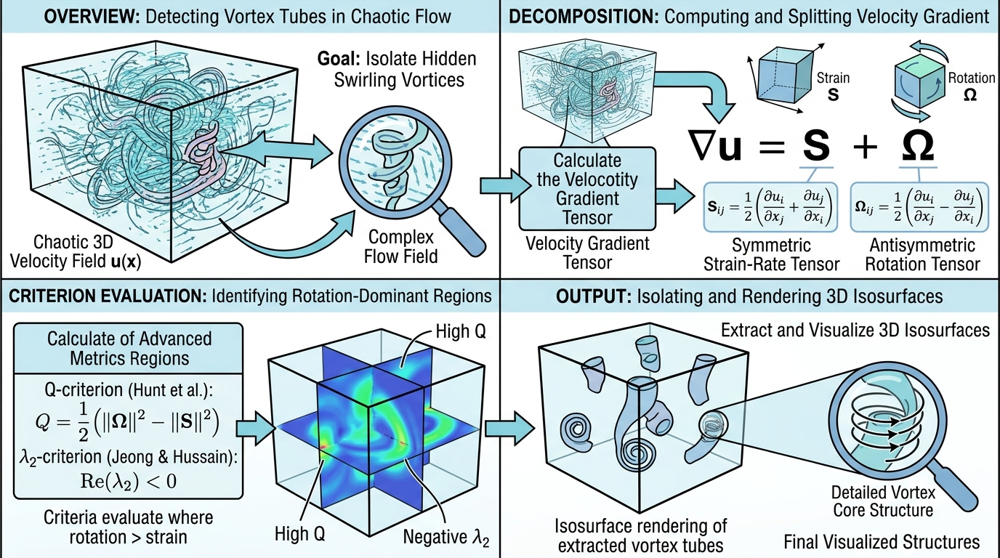

# VortexCriteria (涡流识别判据)

## 示意图

## 1. 目的与核心功能算法解析 🧠

### 目的与功能
在计算流体力学 (CFD) 中，原始的速度矢量场在解析复杂三维湍流时缺乏直观性。`vtkVortexCriteriaFilter` 模块的作用是通过处理输入的三维速度场，计算和输出多种能够表征三维涡旋结构的前沿标量和张量场物理量（如 Q-criterion、$\lambda_2$ 准则等）。这些推导量使得后续针对流体旋涡结构的阈值等值面 (Isosurface) 提取和空间可视化成为可能。

### 核心算法原理解析
该模块通过分析**速度梯度张量 (Velocity Gradient Tensor, $J = \nabla u$)** 来计算衍生物理场：
1. **获取梯度矩阵**：依赖底层 `vtkGradientFilter` 类，计算三维速度场随空间坐标变化的偏导数，得到 $3 \times 3$ 的雅可比矩阵 $J$。
2. **张量分解**：将 $J$ 矩阵基于对称性原理分解为两个关键子张量：
   - **对称部分 (Strain Rate Tensor, $S$)**：表征流体微团发生的线性形变、拉伸及剪切状态。计算公式为 $S = \frac{1}{2}(J + J^T)$。
   - **反对称部分 (Rotation Tensor, $O$)**：表征流体微团发生的纯刚体旋转状态。计算公式为 $O = \frac{1}{2}(J - J^T)$。
3. **推导涡旋判据**：通过分析 $S$ 和 $O$ 之间的相互作用及占优情况判定涡旋区的存在。通过求解特征方程、迹 (Trace)、张量 Frobenius 范数等运算矩阵手段，模块实现了 Q 准则至最新 Liutex 判据等多种识别方法。

---

## 2. 核心参数一览表 🎛️

该模块提供了多个开关参数（布尔型值：0 对应 Off，1 对应 On），以允许用户指定需提取和挂载的输出数据场：

| 参数名称 | 默认值 | 效果与物理含义 |
| :--- | :--- | :--- |
| `VelocityArrayName` | `nullptr` | **目标速度场名称**：指定计算目标的三维速度数据列名称。若不指定，算法将采用输入数据集检测到的首个活动三分量矢量数组。 |
| `Epsilon` | `1e-10` | **安全容差常数 ($\epsilon$)**：浮点保护常量，用于避免归一化过程及数学公式计算中因分母为零导致的除零错误 (Zero Division)。 |
| `ComputeVelocity` | `0` (Off) | **输出速度**：将引用的原始速度数组复刻输出到 PointData 以便于在相同工作管线内执行流线 (Streamline) 验证。 |
| `ComputeVorticity` | `1` (On) | **计算涡量 (Vorticity)**：计算流场旋转的角速度向量。该值直观呈现旋转物理表现，但也易受边界强剪切层梯度的影响。 |
| `ComputeGradient` | `0` (Off) | **计算速度梯度张量**：将计算取得的完整 $3 \times 3$ 矩阵 $J$ 存储并输出。 |
| `ComputeStrainRate` | `0` (Off) | **计算应变率张量 ($S$)**：输出流场形变的对称部分 $S$。 |
| `ComputeRotationTensor` | `0` (Off) | **计算旋转张量 ($O$)**：输出体现刚体旋转效应的反对称部分 $O$。 |
| `ComputeQCriterion` | `1` (On) | **计算 Q 准则 (Q-criterion)**：利用公式 $Q = \frac{1}{2}(\|O\|_F^2 - \|S\|_F^2)$ 求出标量。当 $Q > 0$ 表明流体微团的旋转率主导了局部应变率，是广泛采用的三维涡识别指标。 |
| `ComputeLambda2` | `0` (Off) | **计算 $\lambda_2$ 准则**：寻找对称张量组合 $S^2 + O^2$ 的第二大特征值。流体动力学表明满足 $\lambda_2 < 0$ 的区域通常指示出压强极小值涡核的中心区。 |
| `ComputeSwirlingStrength` | `0` (Off) | **旋转强度 ($\lambda_{ci}$)**：速度梯度张量的一对共轭复数特征值中的虚部。该项能排除纯剪切干扰并精确反映真实的流体旋转程度。 |
| `ComputeLiutex` | `0` (Off) | **Liutex 向量 (或称 Rortex)**：输出新型涡识别准则三分量矢量值。其特点是能进一步从涡量场中剥离掉剪切部分的污染，表征只进行局域刚体旋转的那部分强度与轴向。 |
| `ComputeOmegaMethod` | `0` (Off) | **Omega 方法 ($\Omega$)**：根据公式 $\Omega = \frac{\|O\|_F^2}{\|S\|_F^2 + \|O\|_F^2 + \epsilon}$ 输出的标量。该值域强制归一化在 [0, 1] 之间，实践中常用等值面 $\Omega = 0.52$ 实现涡结构的稳健识别。 |
| `ComputeHelicity` | `0` (Off) | **计算螺旋度 (Helicity)**：求解速度矢量与对应涡量矢量的点积，同时输出在 [-1, 1] 区间内的相对归一化螺旋度标量。此指标常用于表征三维涡管缠绕和打结的拓扑属性。 |